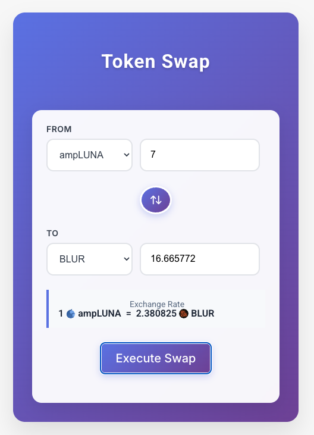

# Currency Swap Form

A modern, intuitive React-based currency swap interface that allows users to exchange cryptocurrencies with real-time price calculations and an elegant user experience.



Discover more and start using the full production features at: https://newwallet.io/swap.

## 🚀 Features

### Core Functionality
- **Real-time Token Swapping**: Exchange between different cryptocurrencies with live price feeds
- **Bidirectional Trading**: Support for both exact input (EXACT_INPUT) and exact output (EXACT_OUTPUT) trade types
- **Live Price Calculations**: Real-time exchange rate calculations with 500ms debounced updates
- **Token Swap Interface**: One-click token position swapping with visual feedback

### User Experience
- **Intuitive Design**: Clean, modern interface optimized for ease of use
- **Visual Token Icons**: Integration with Switcheo token icon repository for visual token identification
- **Loading States**: Smooth loading indicators during calculations and data fetching
- **Error Handling**: Comprehensive input validation with user-friendly error messages
- **Exchange Rate Display**: Clear visualization of current exchange rates between selected tokens

### Technical Features
- **Performance Optimized**: Uses React hooks (useMemo, useCallback) for optimal performance
- **Input Validation**: Real-time form validation with visual error indicators
- **Debounced Calculations**: Prevents excessive API calls during user input
- **Duplicate Token Filtering**: Automatically handles duplicate tokens, keeping the most recent price data
- **Responsive Design**: Mobile-friendly interface that works across devices

## 🛠 Technology Stack

- **Frontend Framework**: React 18+ with TypeScript
- **State Management**: React Hooks (useState, useEffect, useMemo, useCallback)
- **Styling**: Styled Components (custom styled components architecture)
- **Data Source**: Switcheo API for live token prices
- **Icons**: Switcheo token icon repository

## 📋 Requirements Met

1. ✅ **Currency Swap Functionality**: Complete swap form with token selection and amount input
2. ✅ **Input Validation**: Comprehensive validation with error messages for user guidance
3. ✅ **Visual Attractiveness**: Modern, clean design with token icons and smooth animations
4. ✅ **Usage Intuitiveness**: Simple, familiar interface pattern with clear visual hierarchy
5. ✅ **Token Images**: Integration with Switcheo token icon repository
6. ✅ **Price Information**: Real-time price data from Switcheo API with exchange rate calculations

## 🏗 Architecture Overview

### Component Structure
```
SwapForm (Main Component)
├── Token Selection Dropdowns
├── Amount Input Fields
├── Swap Direction Button
├── Exchange Rate Display
├── Validation Error Messages
└── Execute Swap Button
```

### State Management
- **Token Data**: Centralized token information with price data
- **Trade Type**: Tracks whether user is setting input or output amount
- **Form Validation**: Real-time validation state management
- **Loading States**: Separate loading states for data fetching and calculations

### Key Features Implementation

#### Smart Amount Calculation
```typescript
// Automatic calculation based on trade type
- EXACT_INPUT: User sets source amount, target calculated
- EXACT_OUTPUT: User sets target amount, source calculated
- Debounced updates prevent excessive calculations
```

#### Token Management
```typescript
// Efficient token handling
- O(1) token lookup using Map structure
- Automatic duplicate removal with latest price preference
- Sorted token list for better UX
```

#### Validation System
```typescript
// Comprehensive validation
- Token selection validation
- Amount format validation
- Same token prevention
- Real-time error display
```

## 🎯 User Experience Highlights

### Intuitive Workflow
1. **Select Tokens**: Choose source and target cryptocurrencies from dropdown menus
2. **Enter Amount**: Input desired amount in either source or target field
3. **Real-time Calculation**: See immediate conversion with current exchange rates
4. **Visual Feedback**: Clear loading states and error messages guide the user
5. **Execute Trade**: Simple one-click execution when all validations pass

### Smart Interactions
- **Bidirectional Input**: Users can input amounts in either field
- **Automatic Swap**: Quick token position swapping with visual swap icon
- **Live Updates**: Real-time price updates with smooth loading indicators
- **Error Prevention**: Prevents invalid inputs and provides helpful guidance

## 🚀 Getting Started

### Prerequisites
- Node.js 16+ 
- npm or yarn package manager

### Installation
```bash
# Install dependencies
npm install

# Start development server
npm dev
```

### Usage
1. Open the application in your browser
2. Select your source token from the "From" dropdown
3. Select your target token from the "To" dropdown  
4. Enter the amount you want to swap
5. Review the exchange rate and calculated amounts
6. Click "Execute Swap" to complete the transaction

## 🎨 Design Philosophy

The interface follows modern web design principles:
- **Minimalist Approach**: Clean, uncluttered interface focusing on core functionality
- **Visual Hierarchy**: Clear distinction between different UI elements and states
- **Feedback-Driven**: Immediate visual feedback for all user interactions
- **Error-Friendly**: Graceful error handling with constructive error messages
- **Performance-First**: Optimized rendering and state management for smooth experience

## 🔧 Technical Highlights

### Performance Optimizations
- Memoized calculations to prevent unnecessary re-renders
- Debounced API calls to reduce server load
- Efficient token lookup using Map data structure
- Optimized re-rendering with useCallback hooks

### Error Handling
- Network error handling for API failures
- Input validation with real-time feedback
- Graceful fallbacks for missing token icons
- User-friendly error messages

### Accessibility
- Semantic HTML structure
- Proper form labeling
- Keyboard navigation support
- Visual error indicators

## 🔮 Future Enhancements
Potential improvements for production deployment:
- Slippage tolerance settings
- Advanced trading features (limit orders, etc.)
- Wallet integration
- Real-time price alerts
