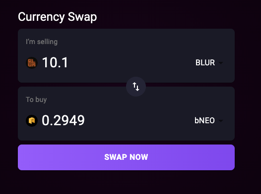

# 💱 Currency Swap Web App

A modern, responsive, and lightning-fast web application for swapping currencies and tokens, built with [Vite](https://vitejs.dev/) and React Typescript.
Easily swap between many tokens, with real-time pricing and sleek dark mode UI.

---

## 🚀 Features

-   ⚡️ **Ultra-fast UI** powered by Vite and React
-   💎 **Modern dark theme** with animated icons and gradients
-   💱 **Real-time price data**
-   🌐 **Responsive design** for desktop and mobile
-   🏦 **Dockerized** for easy deployment
-   🛡️ **TypeScript support** for robust development

---

## 🖥️ Screenshots



---

## 🛠️ Getting Started (Development)

1. **Install dependencies:**

    ```bash
    npm install
    ```

2. **Run the app locally:**

    ```bash
    npm run dev
    ```

    Visit [http://localhost:5173](http://localhost:5173) in your browser.

3. **Environment Variables:**
    - Copy `.env.example` to `.env` and set your custom `VITE_` variables as needed:
        ```
        VITE_API_ENDPOINT=https://interview.switcheo.com/prices.json
        ```

---

## 🐳 Docker Deployment

1. **Build the Docker image:**

    ```bash
    docker build \
      --build-arg VITE_API_ENDPOINT=https://interview.switcheo.com/prices.json \
      -t currency-swap-app .
    ```

2. **Run the Docker container:**

    ```bash
    docker run -d -p 8080:80 --name currency-swap currency-swap-app
    ```

    Your app is now running at [http://localhost:8080](http://localhost:8080)

---

## ⚙️ Configuration

-   All build-time configuration is handled via `VITE_` prefixed environment variables.
    Set them via `.env` file for local, or `--build-arg` for Docker.
-   Example:
    ```
    VITE_API_ENDPOINT=https://interview.switcheo.com/prices.json
    ```
