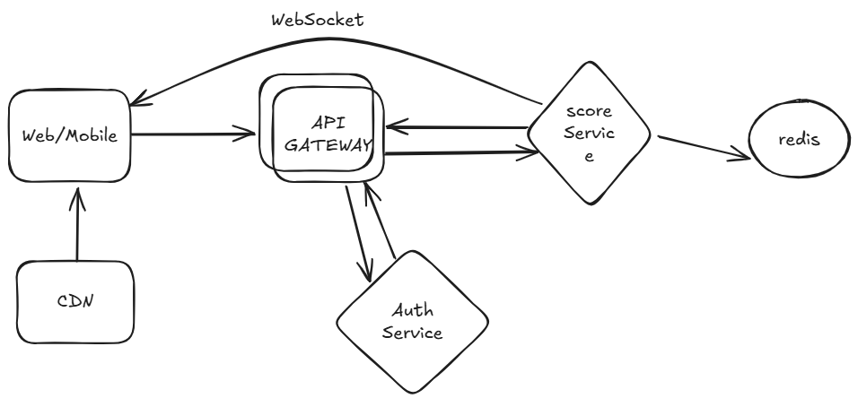

# Scoreboard API Module

This document describes the specifications for the Scoreboard API module, which is responsible for managing and updating the top 10 user scores displayed on a live scoreboard.

## Features

1. **Live Score Updates**: The scoreboard dynamically updates whenever a user's score changes.
2. **User Action Score Increment**: Scores are incremented based on user actions.
3. **Security Against Unauthorized Updates**: Prevents unauthorized users from maliciously manipulating scores.

---

## API Endpoints

### 1. `POST /api/v1/score`

#### Description
Increments a user's score upon completion of an action.

#### Request
- **Headers**:
  - `Authorization: Bearer <token>`
- **Body** (JSON):
  ```json
  {
    "user_id": "<string>",
    "increment": <number>
  }
  ```

#### Response
- **200 OK**
  ```json
  {
    "message": "Score updated successfully",
    "new_score": <number>
  }
  ```
- **400 Bad Request**
  ```json
  {
    "error": "Invalid data"
  }
  ```
- **401 Unauthorized**
  ```json
  {
    "error": "Unauthorized access"
  }
  ```
- **500 Internal Server Error**
  ```json
  {
    "error": "An error occurred"
  }
  ```

### 2. `GET /api/v1/scoreboard`

#### Description
Fetches the top 10 user scores.

#### Request
- **Headers**:
  - `Authorization: Bearer <token>`

#### Response
- **200 OK**
  ```json
  [
    {
      "user_id": "<string>",
      "score": <number>
    },
    ... (up to 10 users)
  ]
  ```
- **401 Unauthorized**
  ```json
  {
    "error": "Unauthorized access"
  }
  ```
- **500 Internal Server Error**
  ```json
  {
    "error": "An error occurred"
  }
  ```

---

## System Components

### 1. **Authentication & Authorization**
- All endpoints require valid Bearer tokens to prevent unauthorized access.
- Use JWT for token-based authentication.

### 2. **Database Schema**
- **`users` table**:
  - `user_id` (Primary Key, String)
  - `score` (Integer)
  - `updated_at` (Timestamp)

### 3. **Real-Time Updates**
- Implement WebSocket or Server-Sent Events (SSE) for pushing live updates to connected clients.

### 4. **Rate Limiting**
- Limit requests to the `POST /api/v1/score` endpoint to prevent abuse.
- Use IP-based or user-specific rate limiting.

---

## Security Measures

1. **Token Validation**:
   - Ensure all API calls are authenticated via JWT.
   - Tokens must include `user_id` and an expiration time.

2. **Input Validation**:
   - Sanitize all input fields to prevent injection attacks.
   - Ensure scoreIncrement does not exceed predefined limits.

3. **Rate Limiting**:
   - Limit maximum requests per user to avoid brute-force attacks or spam.
   - Limit the number of score update requests per user per minute.

4. **Secure Data Storage**:
   - Store sensitive information such as tokens in an encrypted format.

---

## Flow Diagram
The flow diagram for the module is included below:



---

## Suggestions for Improvement

1. **Caching Top Scores**:
   - Use in-memory caching (e.g., Redis) to store the top 10 scores for faster access.

2. **Audit Logging**:
   - Maintain logs of all score updates for future analysis and debugging.

3. **Leaderboard Pagination**:
   - Allow fetching more than the top 10 scores for expanded user engagement.

4. **Automated Testing**:
   - Write unit tests for API endpoints to ensure robustness.

---

## Implementation Notes
- Ensure database transactions are atomic to avoid race conditions.
- Use an ORM like Sequelize or Prisma for database operations to simplify code and improve maintainability.
- Consider horizontal scaling for real-time updates if user traffic increases significantly.

