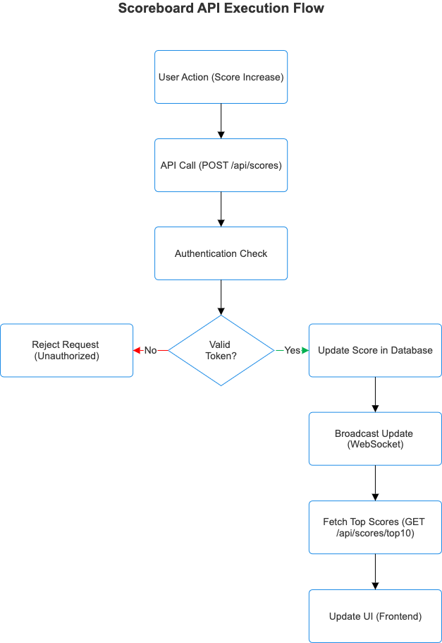

# Scoreboard API - Backend Specification

## Overview

This document describes the API service responsible for managing and updating the scoreboard on our website. The API ensures real-time updates, prevents unauthorized score modifications, and maintains an accurate leaderboard.

## API Endpoints

1. Update User Score

   Endpoint:

   `POST /api/scores`

   Description:

   This endpoint is called when a user completes an action that increases their score.

   Request:

   ```
   {
       "userId": 1,
       "score": 10
   }
   ```

   Response:

   ```
   {
       "userId": 1,
       "score": 10
   }
   ```

   Security Measures:

   Authentication required: Requests must include a valid authentication token.

   Rate Limiting: Prevents abuse by limiting the number of score updates per minute.

   Server-Side Validation: Ensures that the score increment is legitimate.

2. Get Top 10 Scores

   Endpoint:

   `GET /api/scores/top10`

   Description:

   Fetches the top 10 users with the highest scores.

   Response:

   ```
   {
       "scores": [
           { "userId": 1, "score": 200 },
           { "userId": 2, "score": 180 },
           { "userId": 3, "score": 160 }
       ]
   }
   ```

   Security Measures:

   Read-Only Access: No authentication required but protected against abuse.

   Caching: Implements caching to reduce database load and improve performance.

3. Live Score Updates

   WebSocket Connection:

   `ws://server-address/api/scores/live`

   Description:

   Allows the frontend to receive real-time scoreboard updates when a user's score changes.

   Data Format:

   ```
   {
       "userId": 1,
       "score": 210
   }
   ```

   Security Measures:

   Authenticated Connection: Requires a valid token before subscribing.

   Limited Broadcasts: Ensures updates are only sent when necessary.

## Implementation Considerations

Database: Use a relational DB (PostgreSQL) or a fast NoSQL solution (Redis) for live leaderboards.

Scalability: WebSockets may require load balancing for handling large numbers of connections.

Security: Use JWT authentication and rate limiting to prevent abuse.

## Execution Flow Diagram


