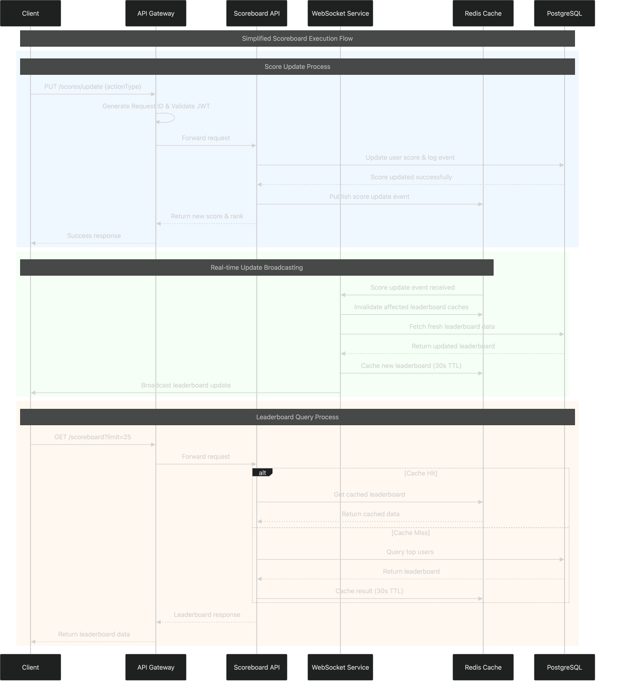

# Scoreboard API Module Specification

## Overview

This document specifies the design and implementation requirements for a real-time scoreboard API module that manages user scores, provides live updates, and ensures secure score modifications.

## Table of Contents

1. [System Requirements](#system-requirements)
2. [Architecture Overview](#architecture-overview)
3. [API Endpoints](#api-endpoints)
4. [Data Models](#data-models)
5. [Security & Authentication](#security--authentication)
6. [Real-time Updates](#real-time-updates)
7. [Database Design](#database-design)
8. [Error Handling](#error-handling)
9. [Performance Considerations](#performance-considerations)
10. [Implementation Guidelines](#implementation-guidelines)
11. [Future Improvements](#future-improvements)


## Architecture Overview

The scoreboard system follows a simplified microservices architecture optimized for real-time leaderboard updates with the following components:

```
┌─────────────────┐    ┌─────────────────┐    ┌─────────────────┐
│   Web Client    │    │   Mobile App    │    │   Game Client   │
└─────────┬───────┘    └─────────┬───────┘    └─────────┬───────┘
          │                      │                      │
          └──────────────────────┼──────────────────────┘
                                 │ HTTPS/WSS
                    ┌────────────▼──────────────┐
                    │     Load Balancer         │
                    │   (SSL Termination)       │
                    └────────────┬──────────────┘
                                 │
                    ┌────────────▼──────────────┐
                    │   API Gateway             │
                    │ • Rate Limiting           │
                    │ • Request ID Generation   │
                    │ • Authentication          │
                    │ • Request Routing         │
                    └────────────┬──────────────┘
                                 │
          ┌──────────────────────┼──────────────────────┐
          │                      │                      │
┌─────────▼─────────┐            │            ┌─────────▼─────────┐
│  Scoreboard API   │            │            │  WebSocket        │
│     Service       │            │            │   Service         │
│ • Score Updates   │            │            │ • Live Updates    │
│ • Leaderboards    │            │            │ • Broadcasting    │
│ • Cache-Aside     │            │            │ • Subscriptions   │
└─────────┬─────────┘            │            └─────────┬─────────┘
          │                      │                      │
          │              ┌───────▼───────┐              │
          │              │ Redis Cluster │              │
          │              │ • Pub/Sub     │              │
          │              │ • Caching     │              │
          │              │ • Sessions    │              │
          │              └───────┬───────┘              │
          │                      │                      │
          └──────────────────────┼──────────────────────┘
                                 │
                    ┌────────────▼──────────────┐
                    │   PostgreSQL Cluster      │
                    │ • Primary (Write)         │
                    │ • Read Replicas (Read)    │
                    │ • User Scores             │
                    │ • Score Events            │
                    │ • Action Types            │
                    └───────────────────────────┘
```

### Architecture Components

#### **Client Layer**
- **Web Client**: Browser-based dashboard for leaderboard viewing
- **Mobile App**: Native mobile applications with real-time updates
- **Game Client**: Game applications that submit score updates

#### **Infrastructure Layer**
- **Load Balancer**: Distributes traffic and handles SSL termination
- **API Gateway**: Central entry point with rate limiting, authentication, and request ID generation

#### **Application Layer**
- **Scoreboard API Service**: Handles REST API endpoints for score updates and leaderboard queries
- **WebSocket Service**: Manages real-time connections and broadcasts leaderboard updates

#### **Data Layer**
- **Redis Cluster**:
  - Pub/Sub messaging for real-time updates
  - Leaderboard caching (Cache-Aside pattern)
  - Session storage for WebSocket connections
- **PostgreSQL Cluster**:
  - Primary database for writes (score updates)
  - Read replicas for leaderboard queries
  - ACID compliance for data consistency

### Key Architectural Decisions

#### **Simplified Service Design**
- **Removed separate Authentication Service**: JWT validation handled at API Gateway level
- **Combined approach**: Scoreboard API handles both REST and triggers real-time updates
- **Focused caching**: Only leaderboards cached, user scores stored directly in database

#### **Real-time Update Flow**
```
Score Update → API Service → Database → Redis Pub/Sub → WebSocket Service → Clients
```

### Flow Diagram



## API Endpoints

### 1. Get Scoreboard
```http
GET /api/v1/scoreboard?limit={size}&offset={offset}
```

**Query Parameters:**
- `limit` (optional): Number of users to return (default: 10, max: 100)
- `offset` (optional): Number of users to skip for pagination (default: 0)

**Examples:**
```http
GET /api/v1/scoreboard                    # Top 10 users (default)
GET /api/v1/scoreboard?limit=25           # Top 25 users
GET /api/v1/scoreboard?limit=50&offset=50 # Users ranked 51-100
```

**Response:**
```json
{
  "success": true,
  "data": {
    "leaderboard": [
      {
        "rank": 1,
        "userId": "user123",
        "username": "player1",
        "score": 15420,
        "lastUpdated": "2024-01-15T10:30:00Z"
      }
    ],
    "pagination": {
      "limit": 10,
      "offset": 0,
      "total": 50000,
      "hasMore": true
    },
    "lastRefresh": "2024-01-15T10:30:00Z"
  }
}
```

### 2. Update User Score
```http
PUT /api/v1/scores/update
Authorization: Bearer <jwt_token>
Content-Type: application/json
```

**Headers:**
```http
Authorization: Bearer <jwt_token>
Content-Type: application/json
X-Request-ID: req_abc123_1642234567890  # Auto-generated by API Gateway/Load Balancer
```

**Request Body:**
```json
{
  "actionType": "LEVEL_COMPLETE",
  "metadata": {
    "level": 5,
    "timeCompleted": 45.2,
    "accuracy": 0.95
  }
}
```

**Field Descriptions:**
- `actionType`: Type of action that determines score increment from server configuration
- `metadata`: Additional context data for the action

**Server-side Score Configuration:**
```json
{
  "LEVEL_COMPLETE": 150,
  "ACHIEVEMENT_UNLOCK": 300,
  "DAILY_BONUS": 50,
  "CHALLENGE_WIN": 500,
  "BOSS_DEFEAT": 1000,
  "PERFECT_SCORE": 200
}
```

**Response:**
```json
{
  "success": true,
  "data": {
    "actionId": "action_67890_1642234567890",
    "requestId": "req_abc123_1642234567890",
    "newScore": 15670,
    "scoreIncrement": 150,
    "newRank": 1,
    "previousRank": 2,
    "actionType": "LEVEL_COMPLETE",
    "processedAt": "2024-01-15T10:30:00Z"
  }
}
```

**Request ID Generation (Infrastructure Level):**
```
API Gateway/Load Balancer automatically generates:
- Format: {service}_{timestamp}_{uuid}
- Example: api_1642234567890_550e8400-e29b-41d4-a716-446655440000
- Header: X-Request-ID
```

**Benefits of Header-Based Approach:**
- ✅ **Infrastructure Standard**: Leverages existing API Gateway functionality
- ✅ **Automatic Generation**: Request ID created at infrastructure level
- ✅ **Complete Audit Trail**: Request tracked from gateway to database

### 3. Get User Score History
```http
GET /api/v1/users/{userId}/scores/history?limit={limit}&offset={offset}
Authorization: Bearer <jwt_token>
```

**Query Parameters:**
- `limit` (optional): Number of events to return (default: 50, max: 200)
- `offset` (optional): Number of events to skip for pagination (default: 0)

**Response:**
```json
{
  "success": true,
  "data": {
    "userId": "user123",
    "events": [
      {
        "eventId": "event_67890_1642234567890",
        "actionId": "action_67890_1642234567890",
        "actionType": "LEVEL_COMPLETE",
        "scoreIncrement": 150,
        "timestamp": "2024-01-15T10:30:00Z",
        "metadata": {
          "level": 5,
          "timeCompleted": 45.2
        }
      }
    ],
    "pagination": {
      "limit": 50,
      "offset": 0,
      "total": 245,
      "hasMore": true
    }
  }
}
```

### 4. WebSocket Connection
```
WSS /ws/v1/scoreboard/live
Authorization: Bearer <jwt_token> (via auth header or query param)
```

#### Live Scoreboard Update Flow

**Connection with Subscription:**
```javascript
// Client connects and subscribes to specific leaderboard size
const socket = io('/ws/v1/scoreboard/live', {
  auth: { token: jwt_token }
});

// Subscribe to top N users (default: 10, max: 100)
socket.emit('subscribe_leaderboard', { limit: 25 });
```

**Server → Client: Scoreboard Update**
```json
{
  "type": "scoreboard_update",
  "data": {
    "leaderboard": [
      {
        "rank": 1,
        "userId": "user123",
        "username": "player1",
        "score": 15420
      },
      {
        "rank": 2,
        "userId": "user456",
        "username": "player2",
        "score": 15200
      }
    ],
    "limit": 25,
    "timestamp": "2024-01-15T10:30:00Z"
  }
}
```

**Update Triggers:**
- Any score change affecting subscribed leaderboard positions (e.g., top 25)
- New user entering subscribed range
- User leaving subscribed range

## Data Models

### Core Data Models

```typescript
// User interface for leaderboard entries
interface User {
  userId: string;
  username: string;
  score: number;
  rank: number;
  lastUpdated: Date;
}

// Detailed user score model
interface UserScore extends User {
  totalActions: number;
  averageScorePerAction: number;
}

// Leaderboard entry for API responses
interface LeaderboardEntry {
  rank: number;
  userId: string;
  username: string;
  score: number;
  lastUpdated: string; // ISO string format
}
```

### Score Update Event Model
```typescript
interface ScoreUpdateEvent {
  eventId: string;
  userId: string;
  actionId: string;
  actionType: string;
  scoreIncrement: number;
  timestamp: Date;
  metadata: Record<string, any>;
  ipAddress: string;
  userAgent: string;
}
```

### Action Type Configuration Model

```typescript
// Action type enumeration
enum ActionType {
  LEVEL_COMPLETE = 'LEVEL_COMPLETE',
  ACHIEVEMENT_UNLOCK = 'ACHIEVEMENT_UNLOCK',
  DAILY_BONUS = 'DAILY_BONUS',
  CHALLENGE_WIN = 'CHALLENGE_WIN',
  BOSS_DEFEAT = 'BOSS_DEFEAT',
  PERFECT_SCORE = 'PERFECT_SCORE',
  STREAK_BONUS = 'STREAK_BONUS',
  FIRST_TIME_BONUS = 'FIRST_TIME_BONUS'
}

// Score configuration mapping
const ACTION_SCORES: Record<ActionType, number> = {
  [ActionType.LEVEL_COMPLETE]: 150,
  [ActionType.ACHIEVEMENT_UNLOCK]: 300,
  [ActionType.DAILY_BONUS]: 50,
  [ActionType.CHALLENGE_WIN]: 500,
  [ActionType.BOSS_DEFEAT]: 1000,
  [ActionType.PERFECT_SCORE]: 200,
  [ActionType.STREAK_BONUS]: 100,
  [ActionType.FIRST_TIME_BONUS]: 250
};

interface ActionTypeConfig {
  actionType: ActionType;
  scoreValue: number;
  description: string;
  category: string;
  isActive: boolean;
}
```

## Security & Authentication

### Authentication Flow
1. **JWT Token Validation**: All score update requests must include valid JWT token
2. **Action Verification**: Each action must have a unique `actionId` to prevent replay attacks
3. **Rate Limiting**: Maximum 100 score updates per minute per user
4. **IP Tracking**: Monitor for suspicious patterns from same IP addresses
5. **Score Validation**: Implement business rules to validate score increments

### Security Measures
- **Server-side Score Control**: Score increments determined by server configuration, not client input
- **Action Type Validation**: Only predefined action types with configured scores are accepted
- **Anomaly Detection**: Flag users with unusual scoring patterns
- **Audit Logging**: All score changes are logged with full context

## Real-time Updates

### Live Scoreboard System

The scoreboard provides real-time updates to all connected clients when scores change, ensuring users see the latest rankings immediately.

### Core Architecture

#### WebSocket Connection
- **Persistent Connection**: Maintains live connection between client and server
- **Authentication**: JWT token validation on connection
- **Auto-Reconnection**: Client reconnects automatically if connection drops

#### Update Flow
```
1. User completes action → API receives score update
2. API updates database and calculates new rankings
3. API publishes update event to message queue
4. WebSocket service receives event and broadcasts to all connected clients
5. Client receives update and refreshes scoreboard display
```

#### Message Broadcasting
- **Redis Pub/Sub**: Coordinates updates across multiple server instances
- **Selective Updates**: Only broadcast when top 10 rankings change
- **Efficient Delivery**: Single message sent to all connected clients

### Update Triggers
- Score change affects subscribed leaderboard positions
- New user enters subscribed range
- User drops out of subscribed range

### Performance Features
- **Caching**: Leaderboard cached in Redis for quick access
- **Efficient Queries**: Database queries optimized with LIMIT and OFFSET
- **Rate Limiting**: Prevent excessive update frequency
- **Connection Scaling**: Support thousands of concurrent connections
- **Subscription Management**: Users only receive updates for their subscribed leaderboard size

## Database Design

### Tables/Collections

#### users_scores
```sql
CREATE TABLE users_scores (
  user_id VARCHAR(255) PRIMARY KEY,
  username VARCHAR(100) NOT NULL,
  current_score BIGINT DEFAULT 0,
  rank INTEGER,
  last_updated TIMESTAMP DEFAULT CURRENT_TIMESTAMP,
  total_actions INTEGER DEFAULT 0,
  created_at TIMESTAMP DEFAULT CURRENT_TIMESTAMP,
  INDEX idx_score_rank (current_score DESC, last_updated),
  INDEX idx_user_lookup (user_id)
);
```

#### score_events
```sql
CREATE TABLE score_events (
  event_id VARCHAR(255) PRIMARY KEY,
  user_id VARCHAR(255) NOT NULL,
  action_id VARCHAR(255) UNIQUE NOT NULL,
  request_id VARCHAR(255) NOT NULL,
  action_type VARCHAR(50) NOT NULL,
  score_increment INTEGER NOT NULL,
  metadata JSON,
  ip_address VARCHAR(45),
  user_agent TEXT,
  created_at TIMESTAMP DEFAULT CURRENT_TIMESTAMP,
  INDEX idx_user_events (user_id, created_at),
  INDEX idx_action_lookup (action_id),
  INDEX idx_request_lookup (user_id, request_id),
  UNIQUE KEY unique_user_request (user_id, request_id),
  FOREIGN KEY (user_id) REFERENCES users_scores(user_id)
);
```

#### action_types
```sql
CREATE TABLE action_types (
  action_type VARCHAR(50) PRIMARY KEY,
  score_value INTEGER NOT NULL,
  description TEXT,
  category VARCHAR(50),
  is_active BOOLEAN DEFAULT TRUE,
  created_at TIMESTAMP DEFAULT CURRENT_TIMESTAMP,
  updated_at TIMESTAMP DEFAULT CURRENT_TIMESTAMP ON UPDATE CURRENT_TIMESTAMP,
  INDEX idx_active_actions (is_active, action_type)
);

-- Insert default action types
INSERT INTO action_types (action_type, score_value, description, category) VALUES
('LEVEL_COMPLETE', 150, 'Complete a game level', 'gameplay'),
('ACHIEVEMENT_UNLOCK', 300, 'Unlock an achievement', 'progression'),
('DAILY_BONUS', 50, 'Daily login bonus', 'engagement'),
('CHALLENGE_WIN', 500, 'Win a challenge', 'competition'),
('BOSS_DEFEAT', 1000, 'Defeat a boss enemy', 'gameplay'),
('PERFECT_SCORE', 200, 'Achieve perfect score', 'performance'),
('STREAK_BONUS', 100, 'Maintain winning streak', 'performance'),
('FIRST_TIME_BONUS', 250, 'First time completing action', 'progression');
```

## Error Handling

### Error Codes
- `INVALID_TOKEN`: Authentication failure
- `DUPLICATE_REQUEST`: Request ID already processed for this user
- `INVALID_ACTION_TYPE`: Unknown or inactive action type
- `MISSING_REQUIRED_FIELDS`: Required fields missing from request
- `INVALID_LIMIT`: Leaderboard limit outside valid range (1-100)
- `RATE_LIMIT_EXCEEDED`: Too many requests
- `USER_NOT_FOUND`: User doesn't exist
- `CACHE_UNAVAILABLE`: Cache service temporarily unavailable
- `DATABASE_UNAVAILABLE`: Database service temporarily unavailable
- `SYSTEM_ERROR`: Internal server error

### Error Response Format
```json
{
  "success": false,
  "error": {
    "code": "DUPLICATE_REQUEST",
    "message": "This request has already been processed",
    "details": {
      "requestId": "api_1642234567890_550e8400-e29b-41d4-a716-446655440000",
      "originalActionId": "action_67890_1642234567890",
      "originalTimestamp": "2024-01-15T10:25:00Z"
    }
  }
}
```

### API Design Benefits

**Ultra-Simplified Client Implementation:**
```javascript
const response = await fetch('/api/v1/scores/update', {
  method: 'PUT',
  headers: {
    'Authorization': `Bearer ${token}`,
    'Content-Type': 'application/json'
    // X-Request-ID automatically added by API Gateway
  },
  body: JSON.stringify({
    actionType: 'LEVEL_COMPLETE',
    metadata: { level: 5 }
  })
});
```

**Infrastructure-Level Security & Control:**
- ✅ **Infrastructure-managed deduplication**: API Gateway handles request IDs
- ✅ **Server generates actionId**: Full control over action identification
- ✅ **Automatic audit trail**: Request tracked from gateway to database
- ✅ **Standard HTTP patterns**: Leverages existing infrastructure capabilities
- ✅ **Bulletproof deduplication**: Infrastructure-level request ID generation

## Performance Considerations

### Caching Strategy

#### **Cache-Aside Pattern for Leaderboard **

**Pattern Selection Rationale:**
- **Cache-Aside for Leaderboards**: Application controls leaderboard cache loading for optimal performance
- **Direct Database for User Scores**: User scores written directly to database for simplicity and consistency

#### **Implementation Details**

**1. Leaderboard Caching (Cache-Aside Pattern)**
```typescript
const cacheKeys = {
  leaderboard: (limit: number) => `leaderboard:top${limit}`,
};

// Consistent TTL for all leaderboard sizes
const LEADERBOARD_TTL = 30;
```

**2. Score Update Flow (Database-Only)**
```typescript
// Simplified score update flow
async function updateUserScore(userId: string, actionType: string) {
  const scoreIncrement = ACTION_SCORES[actionType];

  // Direct database update - no user score caching
  await database.updateUserScore(userId, scoreIncrement);

  // Invalidate affected leaderboard caches
  await invalidateLeaderboardCaches(userId);
}
```

**3. Cache Invalidation Strategy**
```typescript
async function invalidateLeaderboardCaches(userId: string) {
  const userRank = await getUserRank(userId);

  // Smart invalidation based on rank impact
  const cachesToInvalidate = [];

  if (userRank <= 10) cachesToInvalidate.push('leaderboard:top10');
  if (userRank <= 25) cachesToInvalidate.push('leaderboard:top25');
  if (userRank <= 50) cachesToInvalidate.push('leaderboard:top50');
  if (userRank <= 100) cachesToInvalidate.push('leaderboard:top100');

  // Batch invalidation for efficiency
  await redis.del(...cachesToInvalidate);
}
```

#### **Cache Data Types & TTL Configuration**

| **Data Type** | **Cache Key Pattern** | **TTL** | **Pattern** | **Rationale** |
|---------------|----------------------|---------|-------------|---------------|
| **All Leaderboards** | `leaderboard:top{N}` | 30s | Cache-Aside | High read frequency, consistent caching |

**Note:** User scores are stored directly in the database without caching for simplicity and data consistency.

#### **Fallback Mechanisms**

**1. Cache Unavailable Scenarios**
```typescript
interface CacheService {
  get(key: string): Promise<string | null>;
  setex(key: string, ttl: number, value: string): Promise<void>;
  del(...keys: string[]): Promise<number>;
}

interface DatabaseService {
  getTopUsers(limit: number): Promise<LeaderboardEntry[]>;
  updateUserScore(userId: string, scoreIncrement: number): Promise<void>;
  getUserRank(userId: string): Promise<number>;
}

class LeaderboardService {
  private static readonly CACHE_KEY_PREFIX = 'leaderboard:top';
  private static readonly LEADERBOARD_TTL = 30; // 30 seconds - consistent with specification

  constructor(
    private redis: CacheService,
    private database: DatabaseService
  ) {}

  async getLeaderboard(limit: number): Promise<LeaderboardEntry[]> {
    // Input validation
    if (limit <= 0 || limit > 100) {
      throw new Error('Invalid limit: must be between 1 and 100');
    }

    const cacheKey = this.buildCacheKey(limit);

    try {
      // Try cache first (Cache-Aside pattern)
      const cachedData = await this.redis.get(cacheKey);
      if (cachedData) {
        try {
          return JSON.parse(cachedData) as LeaderboardEntry[];
        } catch (parseError) {
          // Invalid cached data - remove it and continue to database
          console.warn(`Invalid cached data for ${cacheKey}, removing:`, parseError);
          await this.redis.del(cacheKey);
        }
      }

      // Cache miss or invalid data - load from database
      const leaderboard = await this.loadLeaderboardFromDatabase(limit);

      // Store in cache asynchronously (fire-and-forget)
      this.setCacheAsync(cacheKey, leaderboard);

      return leaderboard;

    } catch (error) {
      // Cache error - fallback to database
      console.warn(`Cache error for ${cacheKey}, falling back to database:`, error);
      return await this.loadLeaderboardFromDatabase(limit);
    }
  }

  async invalidateLeaderboardCaches(userId: string): Promise<void> {
    try {
      const userRank = await this.database.getUserRank(userId);

      // Smart invalidation based on rank impact
      const cachesToInvalidate: string[] = [];

      if (userRank <= 10) cachesToInvalidate.push(this.buildCacheKey(10));
      if (userRank <= 25) cachesToInvalidate.push(this.buildCacheKey(25));
      if (userRank <= 50) cachesToInvalidate.push(this.buildCacheKey(50));
      if (userRank <= 100) cachesToInvalidate.push(this.buildCacheKey(100));

      // Batch invalidation for efficiency
      if (cachesToInvalidate.length > 0) {
        await this.redis.del(...cachesToInvalidate);
      }
    } catch (error) {
      console.error('Failed to invalidate leaderboard caches:', error);
      // Don't throw - cache invalidation failure shouldn't break score updates
    }
  }

  private async loadLeaderboardFromDatabase(limit: number): Promise<LeaderboardEntry[]> {
    try {
      return await this.database.getTopUsers(limit);
    } catch (dbError) {
      console.error('Database error loading leaderboard:', dbError);
      throw new Error('Leaderboard temporarily unavailable');
    }
  }

  private async setCacheAsync(cacheKey: string, data: LeaderboardEntry[]): Promise<void> {
    try {
      await this.redis.setex(cacheKey, LeaderboardService.LEADERBOARD_TTL, JSON.stringify(data));
    } catch (cacheError) {
      // Log but don't throw - cache setting is optional
      console.warn(`Failed to cache data for ${cacheKey}:`, cacheError);
    }
  }

  private buildCacheKey(limit: number): string {
    return `${LeaderboardService.CACHE_KEY_PREFIX}${limit}`;
  }
}
```

### Database Optimization
- **Indexing**: Optimized indexes for score ranking queries
- **Partitioning**: Partition score_events table by date
- **Read Replicas**: Use read replicas for leaderboard queries

### Scalability
- **Horizontal Scaling**: Stateless API services behind load balancer
- **Message Queue**: Async processing for non-critical operations
- **CDN**: Cache static leaderboard data at edge locations

## Implementation Guidelines

### Technology Stack Recommendations
- **Backend**: Node.js/Nestjs
- **Database**: PostgreSQL with Redis for caching
- **Message Queue**: Redis or RabbitMQ
- **WebSocket**: Socket.io or native WebSocket
- **Authentication**: JWT with RS256 signing

#### Technical Architecture Decisions

**WebSocket vs Server-Sent Events (SSE)**
- **Chosen**: WebSocket for bidirectional communication
- **Rationale**: Enables client subscriptions and heartbeat monitoring
- **Alternative**: SSE for simpler unidirectional updates

**Message Queue Selection**
- **Chosen**: Redis Pub/Sub for simplicity and performance
- **Rationale**: Low latency, built-in clustering, familiar tooling
- **Alternative**: RabbitMQ for complex routing requirements


## Monitoring & Observability

### Key Performance Indicators (KPIs)

#### **System Performance Metrics**
- **API Response Time**: Target <100ms for 95th percentile
- **Cache Hit Ratio**: Target >95% for leaderboard queries
- **Database Query Time**: Target <50ms for leaderboard queries
- **WebSocket Connection Count**: Monitor concurrent connections
- **Message Throughput**: Track real-time update delivery rate

#### **Business Metrics**
- **Active Users**: Concurrent users viewing leaderboards
- **Score Update Frequency**: Actions per minute/hour
- **Leaderboard Query Patterns**: Most requested sizes and frequencies
- **User Engagement**: Time spent viewing leaderboards

### Alerting Strategy

#### **Critical Alerts (Immediate Response)**
- API response time >500ms for 5+ minutes
- Cache hit ratio <80% for 10+ minutes
- Database connection failures
- WebSocket service unavailable
- Error rate >5% for any endpoint

#### **Warning Alerts (Monitor Closely)**
- Cache hit ratio <90% for 30+ minutes
- API response time >200ms for 15+ minutes
- Unusual score update patterns (potential cheating)
- High memory usage (>80%) on any service
- WebSocket connection drops >10% baseline

### Load Testing Requirements

#### **Performance Benchmarks**
```typescript
interface PerformanceBenchmarks {
  concurrent_users: 10000;
  api_requests_per_second: 1000;
  websocket_connections: 5000;
  score_updates_per_minute: 500;
  leaderboard_queries_per_second: 200;
  cache_hit_ratio_target: 0.95;
  api_response_time_p95: 100; // milliseconds
  websocket_message_latency: 500; // milliseconds
}
```

#### **Load Test Scenarios**
1. **Baseline Load**: Normal traffic patterns
2. **Peak Load**: 3x normal traffic for sustained periods
3. **Spike Load**: 10x normal traffic for short bursts
4. **Stress Test**: Gradually increase load until failure
5. **Endurance Test**: Sustained peak load for 24+ hours

## Additional Implementation Notes

### Critical Security Considerations
1. **Action Validation**: Implement server-side validation for all game actions
2. **Rate Limiting**: Enforce strict limits on score update frequency
3. **Anomaly Detection**: Monitor for unusual scoring patterns
4. **Input Sanitization**: Validate all user inputs and metadata
5. **Audit Logging**: Comprehensive logging for security analysis

### Performance Optimization Strategies
1. **Database Indexing**: Optimize queries with proper indexes
2. **Connection Pooling**: Efficient database connection management
3. **Batch Processing**: Group operations for better throughput
4. **CDN Integration**: Cache static content at edge locations
5. **Compression**: Enable gzip compression for API responses

### Deployment & DevOps
1. **Container Orchestration**: Use Kubernetes for service management
2. **Blue-Green Deployment**: Zero-downtime deployment strategy
3. **Auto-scaling**: Horizontal scaling based on metrics
4. **Circuit Breakers**: Fault tolerance for external dependencies
5. **Feature Flags**: Gradual feature rollout capabilities
