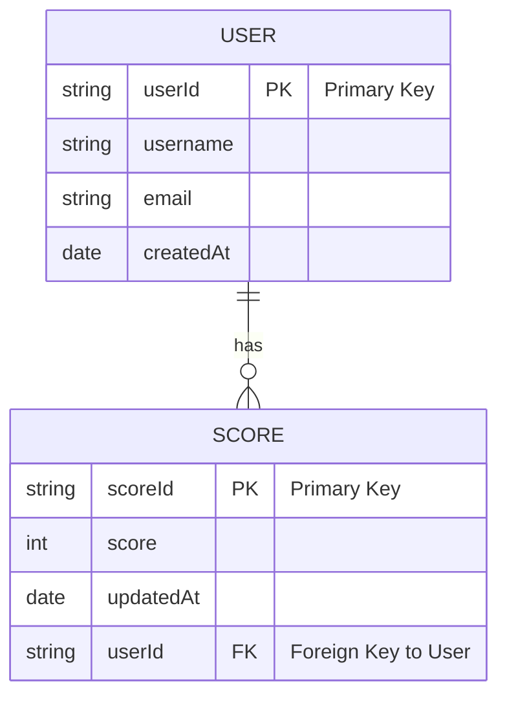
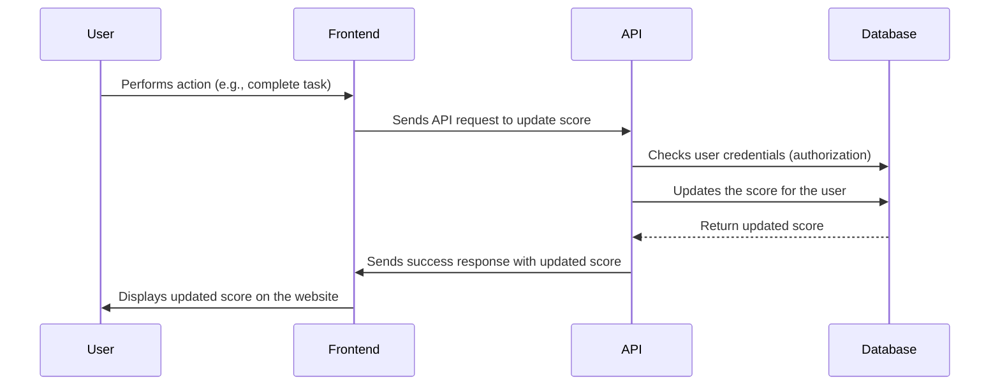

# Table of Contents

1. [Overview](#overview)
2. [Key Features](#key-features)
3. [Main Features](#main-features)
4. [Functional Requirements](#functional-requirements)
5. [API Endpoints](#api-endpoints)
6. [Database Design](#database-design)
7. [Data Flow Diagram](#data-flow-diagram)
8. [Security Considerations](#security-considerations)
9. [Technologies](#technologies)
10. [Improvements & Future Considerations](#improvements-and-future-considerations)

# Overview

This module will be part of a larger backend application and will be responsible for handling the leaderboard for a website. It will enable live updates of user scores, ensuring real-time updates are reflected on the scoreboard.

# Key Features:

1. **Top 10 User Scores**: The system tracks the top 10 highest scores of users.
2. **Live Update**: Users' scores are updated live on the scoreboard when actions are performed.
3. **Secure Score Updates**: Users' scores can only be updated after completing a valid action and passing authorization checks to prevent malicious score manipulation.

# Main Features:

-   **Score Update**: Allowing users to update their scores after performing specific actions.
-   **Live Updates**: The scoreboard should refresh in real time to reflect changes.
-   **Security**: Prevent unauthorized users from updating scores maliciously.

# Functional Requirements:

1. **Scoreboard Display**:

-   The application needs to display the top 10 users' scores.
-   The scoreboard should show the username and the score.

2. **Live Update**:

-   The top 10 scores should update in real time when a user completes an action that increases their score.

3. **Score Update via API**:

-   When a user completes an action, they should send an API request to update their score.
-   The API should receive a user ID and the new score to be applied.

4. **Security**:

-   Ensure that only authorized users can update their own scores.
-   The API should authenticate requests to confirm that the user has the correct authorization to update their score.

5. **Preventing Malicious Actions**:

-   Implement rate-limiting to prevent users from spamming the server with update requests.
-   Validate that the score update is within an expected range, and not too high (e.g., if the update exceeds the current score by an unreasonable amount).

# API Endpoints

1. **POST /api/scores/update**

-   Description: This endpoint receives the score update from the user.
-   **Request Body**:

```bash
  {
    "userId": "string",
    "newScore": "number"
  }
```

-   **Response**

```bash
{
  "message": "Score updated successfully.",
  "currentTopScores": [
    {
      "userId": "user123",
      "score": 100
    },
    ...
  ]
}
```

-   **Status Codes**:
    -   200 OK: Successfully updated the score.
    -   400 Bad Request: Invalid or missing parameters.
    -   401 Unauthorized: Authentication failed.
    -   403 Forbidden: User is not authorized to update the score.
    -   500 Internal Server Error: Server error occurred.

2.  **GET /api/scores/top**

-   **Description**:
    Retrieve the top 10 users' scores.

-   **Response**:

```bash
      [
        {
          "userId": "user123",
          "score": 100
        },
      ...
      ]
```

-   **Status Codes**:
    -   200 OK: Successfully retrieved the top scores.
    -   500 Internal Server Error: Server error occurred.

# Database Design:

The database consists of two main tables:

-   User: Stores user information.
-   Score: Stores score information for each user.

# Data Flow Diagram

The database can be structured with two tables: `Users` and `Scores`. A relationship exists between the users and their scores, where each user has one score, but scores can be updated multiple times.





**Explanation**:

1. The user performs an action that increases their score.
2. The API request is sent to the backend to update the score.
3. The backend server processes the request, authenticates the user, and validates the action.
4. The score is updated in the database.
5. The top 10 scores are returned and displayed on the frontend via real-time updates.

# Security Considerations:

The server ensures that the request to update a score is authorized by checking the provided token or credentials.
A rate-limiting mechanism is implemented to prevent abuse.

1. **Authentication**:

-   Each API request should require user authentication. This can be implemented using JWT (JSON Web Tokens) or OAuth2.
-   Ensure that the user is authorized to update their score by verifying their credentials.

2. **Authorization**:

-   Use role-based access control (RBAC) or similar methods to ensure users can only update their own scores.

3. **Rate Limiting**:

-   Implement a rate-limiting mechanism (e.g., using Redis or a similar solution) to limit how often a user can send requests to update their score.

4. **Input Validation**:

-   Validate that the score sent by the user is within a reasonable range (e.g., does not exceed a threshold value).
-   Ensure the user ID is a valid, registered user.

5. **Cross-Site Request Forgery (CSRF)**:

-   To prevent CSRF attacks, make sure the API requests include necessary headers (like Authorization) or use CSRF tokens.

# Technologies:

-   Backend Framework: Node.js with Express.
-   Database: MongoDB.
-   Authentication: JWT (JSON Web Tokens) or OAuth2.
-   Real-time Updates: Socket.IO or WebSockets.
-   Rate Limiting: Redis or in-memory cache.
-   Security: Helmet.js (for HTTP headers), bcrypt (password hashing), rate-limiter-flexible.

# Improvements and Future Considerations

1. **Scalability**:

-   As the number of users increases, consider sharding or partitioning the database to ensure the leaderboard is scalable.

2. **Caching**:

-   To improve performance, frequently accessed data (such as the top 10 scores) can be cached in a Redis cache to reduce the load on the database.

3. **User Ranking**:

-   Add functionality for a full leaderboard with pagination for more than just the top 10 scores.

4. **Real-Time Notifications**:

-   Integrate push notifications or web socket connections to notify users when the scoreboard has been updated.

```

```
