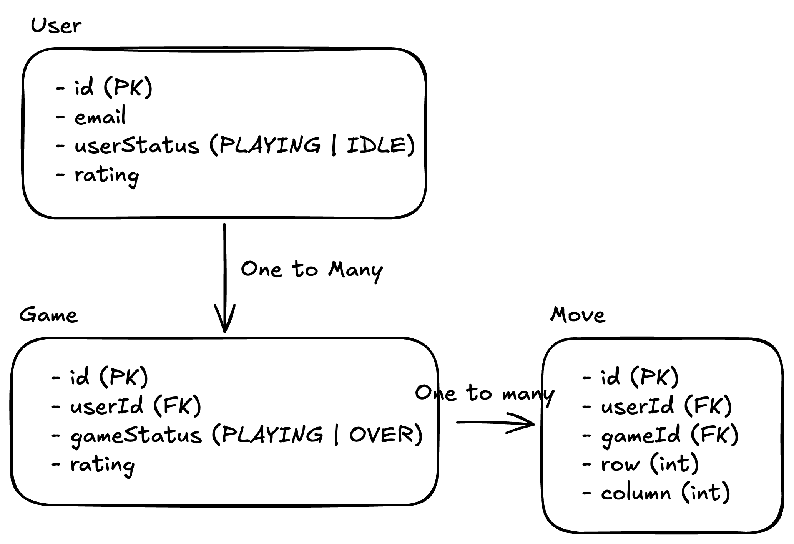
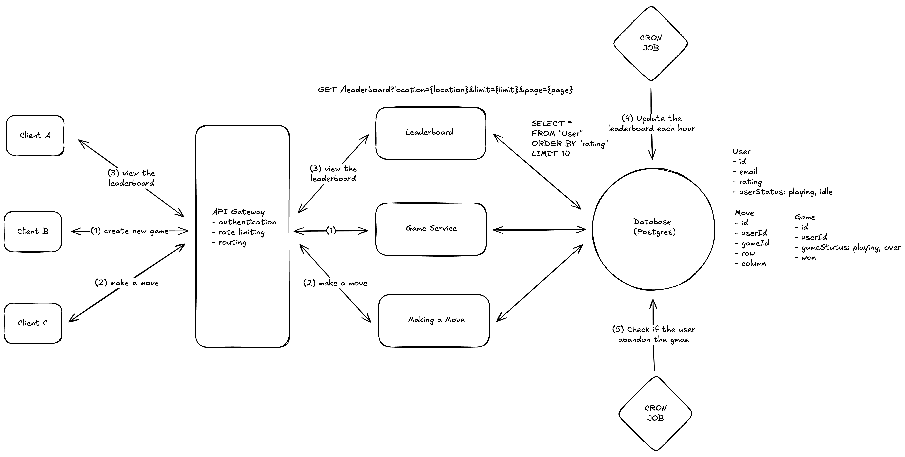
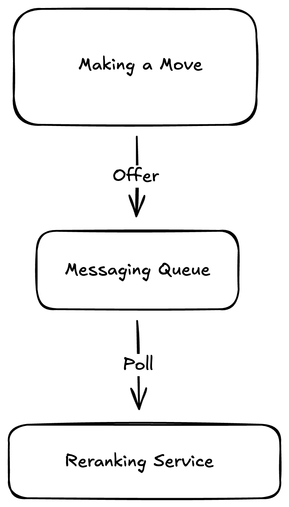

## Problem 6:

***

## 1. Requirements

### 1 Functional Requirement

- Play game and gain rating if won (suppose a game is a matrix puzzle, and we want to move from **top left to bottom right**, each time the user won they gain +25 else -25).
- View top 10 players with the highest rating
- Live update the leaderboard

### 1 Non-functional requirement

- Strong consistency when gaining rating if the player won a game
- But still provide high availability when viewing the dashboard.
- Prioritize write >> read (since there will be million of players all around the world play the game)
- Reduce the latency of live update. 
- Scalability to handle surges from writing from a lot of games happening in the world.
- Ensure the security and prevent player from cheating.

### 1 Out of Scope

- Fault tolerance:
  - What if one of the server is down? How to handle the fail-over?
  - What if there's a disconnection from one of the players, how can he return the game? Should he abandon it?

## 2. Core Entities



- **Player** (id, username, email, rating, userStatus):
  - id (primary key).
  - email (unique).
  - rating (float): current rating of the user.
  - status (enum) - PLAYING | IDLE: is the player is idling or playing the game.
- **Game** (id, userId, gameStatus, won, createdAt):
  - id (primary key).
  - userId (foreign key).
  - gameStatus (enum) - PLAYING | OVER: determines if the game is still playing or over.
  - won (boolean): if the user had won or lose
- **Move** (id, userId, gameId, row, column, createdAt):
  - id (primary key).
  - userId (foreign key).
  - gameId (foreign key).
  - row (int): row of the matrix.
  - column (int): column of the matrix.

## 3. API

### 3.2 User makes a match

```http request
POST /game/new -> Match
headers: JWT | Session Token
```

### 3.3 User makes a move of the game. 

```http request
POST /game/:gameId
headers: JWT | Session Token
{
   row,
   column
}
```

### 3.1 Get the leaderboard, ranked based on the rating

```http request
GET /leaderboard?location={location}&limit={limit}&page={page}  -> User[]
```

## 4. High Level Design



### 1. User requests a new game.

- When User requests a new game, the database would create a Game:
  - `userStatus` as `PLAYING`.
  - `gameStatus` as `PLAYING`.
- Service returns a status: 200 and User would redirect into the game.
- Make sure that the User's status is still `IDLE` to be eligible for creating a new game.

### 2. User makes a move.

- When User making a move, we store the Move.
- Push the event to FE by using Web Socket or Server-sent push to render the page and display the current move.
- Ensure that Move is **valid** by checking if there are any missing moves. For example:
  - if user's in (0,0) -> (2,2) (THIS IS INVALID).
  - if user's in (0,0) -> (1,0) (THIS IS VALID).


- Move until it reaches to the bottom right and gain the rating.
  - If the User won, they gain rating:
    - Increase the User's rating to `+25` (suppose you gain 25 rating whenever you won game).
    - When a User's rating is updated -> push new event to rerank the leaderboard and send event to FE in order to rerender.
    - Set `userStatus` as `IDLE`.
    - Set `gameStatus` as `OVER`.
    - Set `won` to be `True`
  - If the User lose:
    - Decrease the User's rating to `-25`.
    - When a User's rating is updated -> push new event to rerank the leaderboard and send event to FE in order to rerender.
    - Set `userStatus` as `IDLE`.
    - Set `gameStatus` as `OVER`.
    - Set `won` to be `False` - 

### 3. Get the Leaderboard

- Get the leaderboard based on the highest rating
- Whenever there are some event that update the rating of the User, the WebSocket would push the event in order to rerender the frontend.

### 4. Cron Job A

- This Cron Job would be responsible for re-calculating the rating of each user by:
  - Aggregating all the games they've been playing so far.
  - Replaying each of them to recalculate the rating. 
    - [won, lose, won, lose, won, won] -> [25,-25,25,-25,25,25] -> 50
- This would help in a situation if there are some mistakes on the code that calculate at the MakingMove step.
- Cron Job would run by each hour.

### 5. Cron Job B

- This Cron Job would be responsible for checking if the user abandon any matches by:
  - Getting all the Games with status is `PLAYING`.
  - Check if the Move's `createdAt` has a distance with the current for `15 - 20 minutes`.
  - We would mark the Game's status as `OVER`, the user lost rating and User's status would be `IDLE`.
- If the User returns from the disconnection, he can return from the game.
- This should run for each 5 minutes.

## 5. Deep Dive

### 1. Scaling your internal Services

- Move Service would be put through a huge spiked traffic if there are a lot of players playing at the same time.
- And along with that we have to ensure if the player is won, reranking would happen -> causing a lot of stress to the service.



- The idea is decoupling them with a messaging queue.
- When a request for reranking happened for a specific player, we could push it into a Messaging Queue.
- A Reranking Service would do a **long polling**, which is a mechanism allows the Service to waiting for a new event to be happened, reducing a lot of calling to the Queue -> reducing cost.
- The benefit is that this would keep the Reranking Service running at its own pace and send the event for re-rendering the FE dashboard.

### 2. Scaling Horizontally

- Consider scaling the services horizontally with Auto Scaling Group + Load Balancer.
  - Seamlessly handle failures.
  - Handle large load of throughput.

### 3. Reduce the latency of pushing event

- In order for the Server to push the event with low latency, it needs the requirements:
  - The server has to be near the user's location.
  - It's a good idea to deploy your database near the server. 

### 4. Scaling your Database

- The strategy is we would deploy our application into several regions with the most played users.
- Enable the multi-regions and read-replicas features (RDS and Aurora are fully managed this).
  - Multi-regions has bare severs located at Availability Zone within the same region with the Primary Database, when the Primary Database failed, the replica will take over and handle as Primary Database (Sync replication).
  - Read replicas allows you to have up to 15 replicas that would be responsible for handling any read operations, reduce a ton of resources from the Primary Database (Async replication).
- This ensures the fail-over for the system.

### 5. Partitioning the Database

- Cron Job and Reranking Service, they're both responsible for updating the leaderboard.
- Consider enabling Partitioning your database into each segments since we had a lot of readings to rerank. 
  - Partitioning would help split a big set of data into each smaller segment, hence reduce overwhelmingly the searching.

## 6. Out of Scope

### Caching Frontend with CDN

- Using CDN like CloudFlare or CloudFront to cache the static contents.
- Using CND with dyanmic content is still fine, if we set TTL to be really low (2 -> 5 seconds).
- I would argue that, for any dynamic contents that would be updated regularly especially in this problem, caching CDN is a bad idea for any of those.