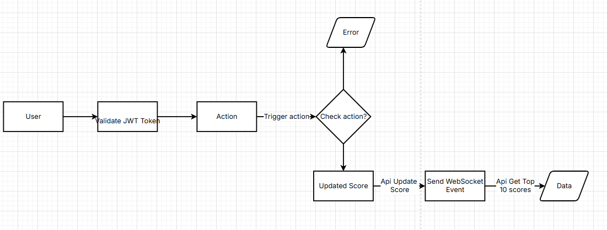

# Scoreboard API Service

## Overview
The Scoreboard API Service is designed to manage and display user scores for the leaderboard feature on the website. It ensures real-time updates of the top 10 scores while implementing security measures to prevent unauthorized score modifications.

## Features
1. **Leaderboard Display**: Displays the top 10 user scores.
2. **Live Updates**: Automatically refreshes the leaderboard in real-time.
3. **User Interaction**: Allows users to perform actions that increase their scores.
4. **API Integration**: Updates user scores through API calls triggered by completed actions.
5. **Score Validation**: Ensures each user action results in only one score increment.
6. **Enhanced Security**: Implements measures to protect against tampering or unauthorized updates.

---

## API Endpoints

### `GET /scores`
- **Description**: Retrieves the top 10 scores for display on the leaderboard.
- **Response**: Returns a list of the top 10 user scores, sorted in descending order.

### `POST /user/update`
- **Description**: Updates a user's score based on their completed actions.
- **Authentication**: Requires a valid authentication token.
- **Request Body**:
  ```json
  {
    "score_increment": 10
  }

### Diagram

