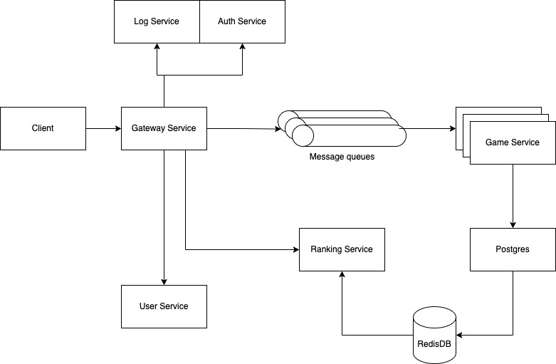
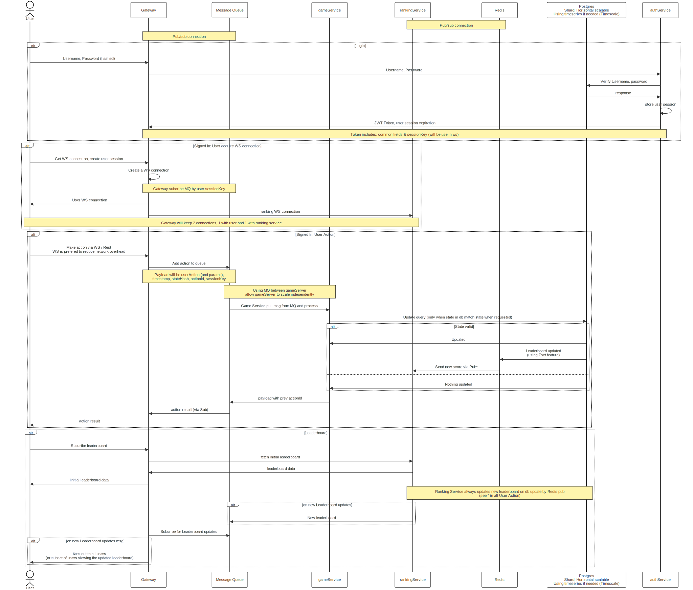

# Table Of Contents
- [Architecture](#architecture)
- [Flow diagram](#flow-diagram)
- [Improvement areas](#improvement-areas)
- [Decision explanation](#decision-explanation)

## Architecture

## Flow diagram
(sequence diagram)

Basically, the live `Leaderboard` feature is at the bottom. Have a look there and the * section at `Alt: User Action`. 
Above that are the required authentication (and connection establish) steps to wire all the things together. 

## Improvement areas
### Protobuf
Instead of using plain JSON string object as communication method in WS, we can use protobuf to greatly reduce the data size, reduce latency of leaderboard update. 

### Caching leaderboard
Somewhere nearer to the gateway, or even in the gateway itself. 

### Multi cloud
Self explained, for HA purpose. 

## Decision explanation

### Choice of introding a message queue
Allow all parts of the system to be scaled up horizontally without depends on each other

### Choice of prefered WS to handle user action
Rest request will have some overhead (http headers, jwt token). 

### Choice of PG as db
Users actions can late on be consider as timeseries data. 
Postgres have a Timescale extension which is dealing with timeseries data very well. 

Why not Influx?
- PG have much larger community. Thus, finding another developer is much easier, seeking out for help or problem is much easier. 
- PG have all the tradditional features (ACID, indexing and stuffs) of the database and is more familiar than Influx. 

Why not mongo (with timeseries feature)?
- Mongo timeseries is still young and not have much supports for statistical analyzing. 
- PG also supports JSON document to an acceptable degree when we need NoSQL support. 