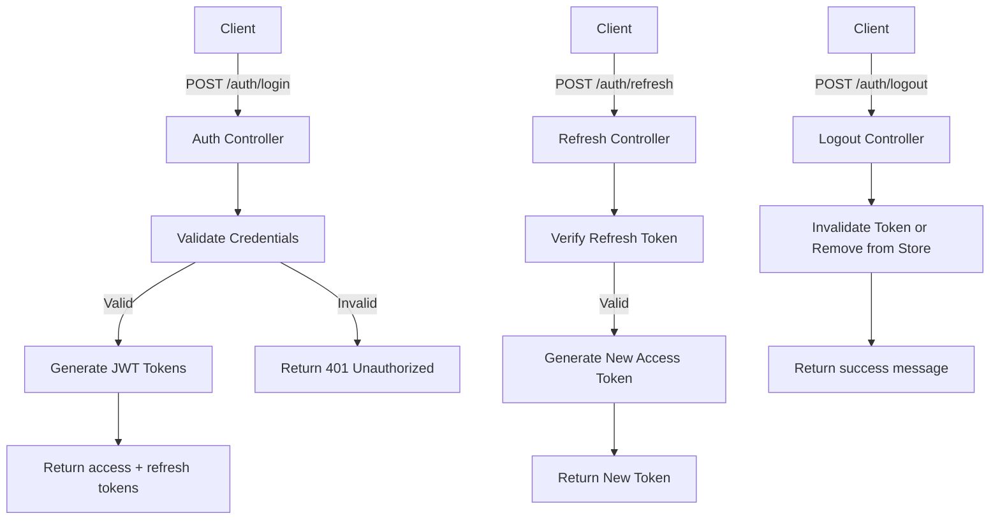
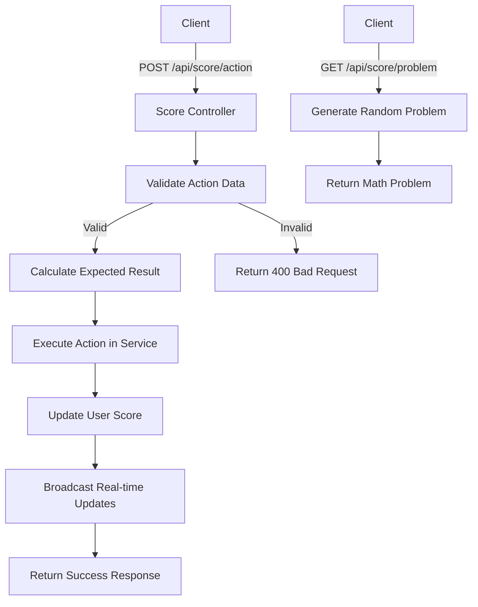
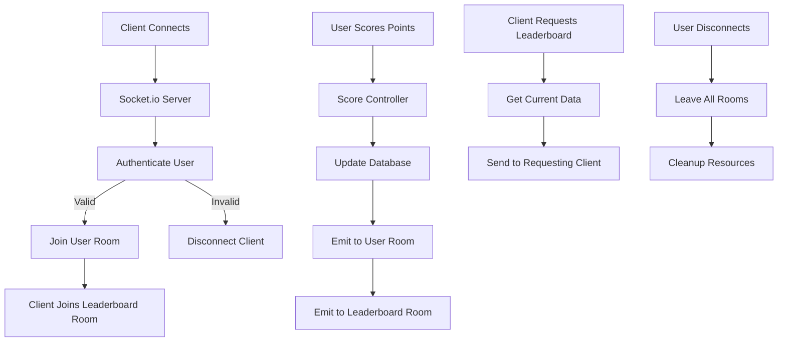

# Specification Module

## 1. Authentication Module

### Features

- User registration
- User login with email & password
- Secure password hashing with bcrypt
- JWT access token generation and validation
- Refresh token mechanism
- Logout and token invalidation

### API Endpoints

#### 1. Register

- `POST /auth/register`
- **Request Body:**
```json
  {
    "email": "user@example.com",
    "password": "strongpassword"
  }
  {
    "user": { "id": "uuid", "email": "user@example.com" },
    "accessToken": "jwt",
    "refreshToken": "jwt"
  }
```

#### 2. Login

- `POST /auth/login`
- **Request Body:**
```json
  {
    "email": "user@example.com",
    "password": "strongpassword"
  }

{
  "user": { "id": "uuid", "email": "user@example.com" },
  "accessToken": "jwt",
  "refreshToken": "jwt"
}
```

#### 3. Logout
- `POST /auth/logout`
- **Request Body:**
```json
  {
    "refreshToken": "jwt"
  }
```

#### 4. Refresh Token
- `POST /auth/refresh`
- **Request Body:**
```json
  {
    "refreshToken": "jwt"
  }

{
  "accessToken": "jwt"
}
```

#### 5. Get User Profile
- `GET /auth/profile`
- **Request Body:**
```json
  {
    "refreshToken": "jwt"
  }

{
  "user": { "id": "uuid", "email": "user@example.com" }
}
```

### Technologies Used

- bcrypt: for password hashing
- JWT (jsonwebtoken): for access & refresh tokens
- PostgreSQL / Supabase: for storing user records (can be changed)
- Express.js / Next.js API routes: as the API layer
- Socket.io: for real-time updates
- Zod: for validation
- Docker Compose: for multi-container orchestration

### Flow Diagram



## 2. Score Management Module

### Features

- Execute mathematical operations (+/-) to earn points
- Generate random math problems for users
- Track user action history and scoring
- Action cooldown to prevent spam
- Real-time score updates

### API Endpoints

#### 1. Execute Math Action

- `POST /api/score/action`
- **Request Body:**
```json
{
  "action": "plus", // or "minus"
  "operand1": 5,
  "operand2": 3,
  "result": 8
}
```
- **Response:**
```json
{
  "success": true,
  "message": "Action executed successfully",
  "result": {
    "expected_result": 8,
    "points_earned": 1,
    "new_score": 15
  }
}
```

#### 2. Generate Math Problem

- `GET /api/score/problem`
- **Response:**
```json
{
  "success": true,
  "problem": {
    "operand1": 7,
    "operand2": 4,
    "action": "plus"
  }
}
```

#### 3. Get User Action History

- `GET /api/score/history?limit=10`
- **Response:**
```json
{
  "success": true,
  "history": [
    {
      "id": "uuid",
      "action": "plus",
      "operand1": 5,
      "operand2": 3,
      "result": 8,
      "points_earned": 1,
      "created_at": "2024-01-15T10:30:00Z"
    }
  ]
}
```

### Technologies Used

- PostgreSQL: for storing scores and action history
- Zod: for input validation
- Express.js: for API endpoints
- Socket.io: for real-time score updates
- JWT: for authentication
- Rate limiting: to prevent action spam

### Flow Diagram



## 3. Real-time Module

### Features

- Live leaderboard updates via WebSocket
- Real-time personal score notifications
- User rank change notifications
- Connection management and room-based broadcasting
- Automatic reconnection handling
- Efficient message delivery system

### Socket.io Events

#### Server → Client Events

##### 1. Leaderboard Update
- **Event:** `leaderboard_update`
- **Purpose:** Broadcast leaderboard changes to all subscribed clients
- **Payload:**
```json
{
  "leaderboard": [
    {
      "user_id": "uuid",
      "username": "player1",
      "email": "player1@example.com",
      "score": 150,
      "rank": 1
    }
  ],
  "updated_at": "2024-01-15T10:30:00Z",
  "triggered_by": "user_uuid"
}
```

##### 2. Personal Score Update
- **Event:** `score_update`
- **Purpose:** Notify user of their score changes
- **Payload:**
```json
{
  "new_score": 45,
  "points_earned": 1,
  "updated_at": "2024-01-15T10:30:00Z"
}
```

### Technologies Used

- Socket.io: for WebSocket communication
- Express.js: for HTTP server integration
- JWT: for WebSocket authentication
- Room-based broadcasting: for efficient message delivery
- Redis (optional): for scaling across multiple server instances

### Flow Diagram



### Connection Management

- **User Rooms:** Each authenticated user joins a personal room (`user_${userId}`)
- **Leaderboard Room:** Clients interested in leaderboard updates join `leaderboard` room
- **Authentication:** JWT tokens validated on connection
- **Graceful Disconnection:** Automatic cleanup of user sessions
- **Reconnection:** Clients automatically rejoin appropriate rooms on reconnect