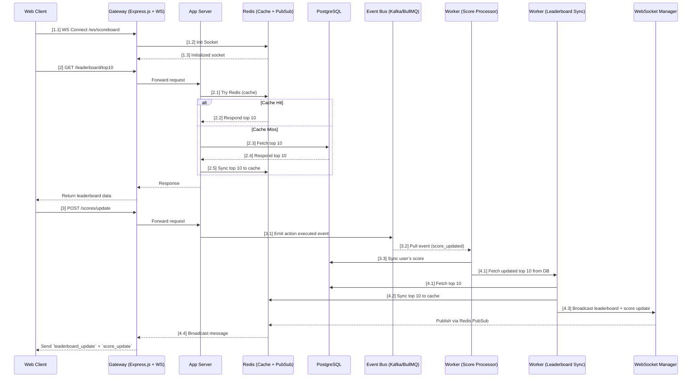

# Scoreboard API Service

## Overview

The Scoreboard API Service is a backend system for managing user scores and providing real-time leaderboard updates. It securely handles score submissions, maintains a leaderboard, and broadcasts changes using WebSocket connections. With an event-driven architecture powered by a Message Queue (MQ), the system achieves scalability, resilience, and decoupled services.

---

## Technology Stack

- **Backend Framework**: Express.js
- **Language**: TypeScript
- **Database**: PostgreSQL
- **Cache**: Redis (leaderboard + rate limit + token store)
- **WebSocket**: WS or Socket.IO
- **Authentication**: JWT
- **Message Queue**: BullMQ / Kafka / RabbitMQ

---

## Key Features

- Secure score update with JWT and action tokens
- Leaderboard with top 10 users
- Real-time broadcasting using WebSockets
- Redis caching for leaderboard performance
- Rate limiting and anti-cheat token validation
- Asynchronous processing via Message Queue

---

## System Architecture


---

## Sequence Diagram



---

## Components

### Core Modules

- **ScoreService**: Processes score changes, validates tokens, and emits events.
- **LeaderboardService**: Manages Redis leaderboard (ZSET).
- **WebSocketManager**: Listens to MQ and broadcasts updates to clients.
- **RateLimitingMiddleware**: Enforces per-user and per-IP rate limits.
- **AuthenticationMiddleware**: Validates JWT tokens and permissions.

---

## API Endpoints

### POST /api/scores/update

```http
POST /api/scores/update
Authorization: Bearer <JWT>
Content-Type: application/json
```

```json
{
  "actionToken": "unique_token",
  "scoreIncrease": 10,
  "actionType": "level_complete"
}
```

**Response**

```json
{
  "success": true,
  "data": {
    "userId": 1,
    "newScore": 1010,
    "rank": 7
  }
}
```

---

### GET /api/leaderboard

```http
GET /api/leaderboard
```

**Response**

```json
{
  "success": true,
  "data": {
    "leaderboard": [
      { "rank": 1, "userId": 100, "username": "player1", "score": 9999 },
      { "rank": 2, "userId": 200, "username": "player2", "score": 9000 }
    ],
    "lastUpdated": "2025-07-25T10:30:00Z"
  }
}
```

---

### POST /api/actions/token

```json
{
  "actionType": "level_complete",
  "expectedScore": 10
}
```

**Response**

```json
{
  "actionToken": "act_12345_abcdef",
  "expiresAt": "2025-07-25T10:31:00Z"
}
```

---

### WebSocket: /ws/scoreboard

**Connection Header**:  
`Authorization: Bearer <JWT>`

**Message Types**

```json
{
  "type": "leaderboard_update",
  "data": {
    "leaderboard": [
      {
        "rank": 1,
        "user_id": "1",
        "username": "player1",
        "score": 2000,
      },
      ...
    ]
  },
  "timestamp": "2025-07-25T10:30:00Z"
}
```

---

## PostgreSQL Schema

```sql
CREATE TABLE users (
    id SERIAL PRIMARY KEY,
    username VARCHAR(50) UNIQUE NOT NULL,
    email VARCHAR(100) UNIQUE NOT NULL,
    created_at TIMESTAMP DEFAULT CURRENT_TIMESTAMP
);

CREATE TABLE scores (
    id SERIAL PRIMARY KEY,
    user_id INTEGER REFERENCES users(id) ON DELETE CASCADE,
    total_score INTEGER DEFAULT 0 NOT NULL,
    last_updated TIMESTAMP DEFAULT CURRENT_TIMESTAMP,
    UNIQUE(user_id)
);

CREATE TABLE score_transactions (
    id SERIAL PRIMARY KEY,
    user_id INTEGER REFERENCES users(id) ON DELETE CASCADE,
    score_delta INTEGER NOT NULL,
    action_type VARCHAR(50) NOT NULL,
    timestamp TIMESTAMP DEFAULT CURRENT_TIMESTAMP,
    client_ip INET,
    user_agent TEXT
);
```

---

## Security & Anti-Cheat

### Action Token System

- Short-lived, one-time tokens in Redis.
- Used to validate score update authenticity

### Rate Limiting (in Redis)

---

## Message Queue Events

### Event: `score_updated`

```json
{
  "userId": 1,
  "username": "player1",
  "scoreIncrease": 10,
  "actionType": "level_complete",
  "timestamp": "2025-07-25T10:31:00Z"
}
```

---

## Health Check

```http
GET /health
```

**Response**

```json
{
  "status": "healthy",
  "database": "connected",
  "redis": "connected",
  "websocket": "active_connection"
}
```

### Conclusion

This specification provides a robust foundation for implementing a secure, scalable scoreboard system with real-time updates. The modular architecture allows for easy extension and maintenance while ensuring security against malicious score manipulation.
