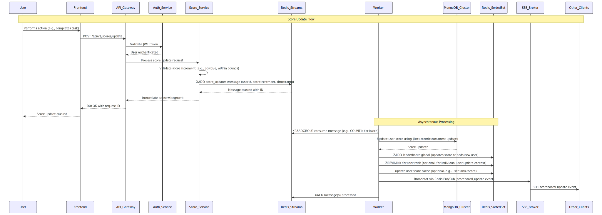

# Scoreboard Module - Backend Developer Specification

## Overview
Real-time scoreboard system with live updates for top 10 users. Users perform actions that increment their scores via API calls.

## Requirements
1. Display top 10 user scores
2. Live scoreboard updates
3. User actions trigger score increases
4. API endpoint for score updates
5. Prevent unauthorized score manipulation

## High-Level Architecture


## Complete System Flow


*The main diagram shows the complete flow with sections marked for detailed views below.*

## Architecture Flow

### Score Update Process
1. User performs action → Frontend calls API
2. API Gateway validates JWT token
3. Score Service validates and queues update
4. Worker processes update asynchronously
5. Updates MongoDB and Redis leaderboard
6. Broadcasts update via SSE

### Live Updates
- SSE connection for real-time scoreboard updates
- Redis Pub/Sub for broadcasting changes
- Automatic reconnection handling

## Detailed Flow Diagrams

### Score Update Flow


#### Score Validation & Queuing


**Process Details:**
- **Input Validation**: Check score increment is positive and within limits
- **Authentication**: JWT token validation and user extraction
- **Message Queuing**: Store update request in Redis Streams with metadata
- **Immediate Response**: Return acknowledgment to user while processing continues

#### Asynchronous Score Processing


**Process Details:**
- **Batch Processing**: Consume multiple messages for efficiency
- **Atomic Updates**: Use MongoDB $inc for race-condition-free updates
- **Leaderboard Sync**: Update Redis Sorted Set for real-time queries
- **Real-time Broadcast**: Send SSE events to all connected clients
- **Message Acknowledgment**: Confirm successful processing

### Leaderboard View Flow


## API Endpoints

### POST /api/v1/scores/update
```json
{
  "scoreIncrement": 10
}
```

### GET /api/v1/scores/leaderboard
Returns top 10 users with scores

### GET /api/v1/scores/events (SSE)
Real-time scoreboard updates

## Tech Stack
- **API Gateway**: Route requests, handle auth
- **Auth Service**: JWT validation
- **Score Service**: Process score updates
- **Redis Streams**: Message queue for async processing
- **MongoDB**: User scores storage
- **Redis Sorted Set**: Leaderboard cache
- **SSE Broker**: Real-time updates

## Security
- JWT authentication on all endpoints
- Input validation for score increments
- Rate limiting on score updates

## Pros & Cons

### Pros
- **High Performance**: Redis Sorted Set for O(log N) leaderboard queries
- **Scalability**: Async processing with Redis Streams
- **Real-time**: SSE for instant updates
- **Reliability**: Message persistence with Redis Streams
- **Atomic Updates**: MongoDB $inc prevents race conditions

### Cons
- **Complexity**: Multiple services to maintain
- **Latency**: Async processing adds delay
- **Infrastructure**: Requires Redis, MongoDB, message queues
- **Cost**: More infrastructure components
- **Debugging**: Distributed system harder to debug

## Considerations

### Performance
- Redis Streams batch processing for efficiency
- **Worker batch consumption** - Process multiple messages in single XREADGROUP call
- Connection pooling for database connections
- SSE connection limits per server

### Scalability
- Horizontal scaling of workers
- Redis cluster for high availability
- MongoDB sharding for large datasets

### Monitoring
- Track message processing latency
- Monitor Redis memory usage
- Alert on failed score updates

### Data Consistency
- Eventual consistency model
- Handle worker failures gracefully
- Implement retry mechanisms

### Worker Batch Processing
- **Batch Size**: Configure optimal COUNT parameter for XREADGROUP
- **Processing Window**: Balance between latency and throughput
- **Error Handling**: Partial batch failures and retry strategies
- **Memory Management**: Avoid memory spikes with large batches
- **Monitoring**: Track batch processing times and success rates

## Implementation Notes
- Use Redis Streams for reliable message processing
- Implement proper error handling and retries
- Ensure atomic updates to prevent race conditions
- Scale workers horizontally for high throughput

