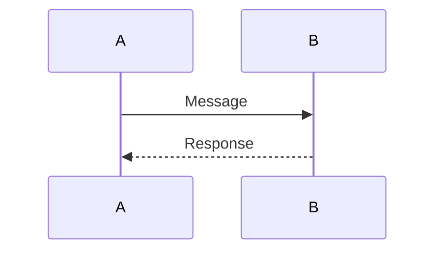

# Usage Guide - Scoreboard API Specification

## Quick Start

This project uses **Yarn** for package management and includes automated diagram generation from Mermaid source files.

### Prerequisites

- Node.js (v16 or higher)
- Yarn (v1.22 or higher)

### Installation

1. **Install dependencies:**
   ```bash
   yarn install
   ```

2. **Generate the diagram:**
   ```bash
   yarn generate-diagram
   ```

3. **View the documentation:**
   Open `README.md` in your markdown viewer to see the complete specification with embedded diagram.

### Automated Setup

You can also use the provided setup script:

```bash
chmod +x setup.sh
./setup.sh
```

This script will:
- Check for Node.js and Yarn installation
- Install all dependencies
- Generate the diagram automatically
- Provide status feedback

## File Structure

```
src/problem6/
├── README.md                    # Complete API specification
├── diagrams/
│   ├── scoreboard-flow.mermaid  # Mermaid diagram source
│   └── generated/
│       └── scoreboard-flow.svg  # Generated SVG diagram
├── package.json                 # Yarn dependencies
├── generate-diagram.js          # Diagram generation script
├── setup.sh                     # Automated setup script
├── .yarnrc.yml                  # Yarn configuration
├── .gitignore                   # Git ignore rules
├── USAGE.md                     # This usage guide
└── requirements.md              # Original requirements
```

## Diagram Generation

The diagram is generated from the Mermaid source file (`diagrams/scoreboard-flow.mermaid`) using the `@mermaid-js/mermaid-cli` package.

### Regenerating the Diagram

If you modify the Mermaid source file, regenerate the diagram:

```bash
yarn generate-diagram
```

### Mermaid Syntax

The diagram uses standard Mermaid sequence diagram syntax:



### Output Format

- **SVG Format**: High-quality vector graphics for crisp text and scalable diagrams
- **White Background**: Clean, professional appearance
- **Scalable**: Perfect quality at any zoom level

## Customization

### Modifying the Diagram

1. Edit `diagrams/scoreboard-flow.mermaid`
2. Run `yarn generate-diagram`
3. The updated diagram will be embedded in `README.md`

### Adding New Diagrams

1. Create a new `.mermaid` file in the `diagrams/` folder
2. Update `generate-diagram.js` to include the new diagram
3. Run `yarn generate-diagram` to generate the image
4. Update the main `README.md` to reference the new diagram

### Adding New Dependencies

1. Edit `package.json`
2. Run `yarn install`
3. Update scripts as needed

## Troubleshooting

### Common Issues

1. **Yarn not found:**
   ```bash
   npm install -g yarn
   ```

2. **Permission denied on setup.sh:**
   ```bash
   chmod +x setup.sh
   ```

3. **Diagram generation fails:**
   - Check that `diagrams/scoreboard-flow.mermaid` exists
   - Verify Node.js version compatibility
   - Check console output for specific errors

### Dependencies

- `@mermaid-js/mermaid-cli`: Command-line tool for Mermaid diagram generation
- `mermaid`: Mermaid library for diagram rendering

## Contributing

When contributing to this specification:

1. Update the Mermaid source file in `diagrams/`
2. Regenerate the diagram
3. Update the README.md documentation
4. Test the setup process

## Support

For issues with the diagram generation or setup process, check:
- Node.js and Yarn versions
- Console error messages
- File permissions
- Network connectivity (for package downloads) 