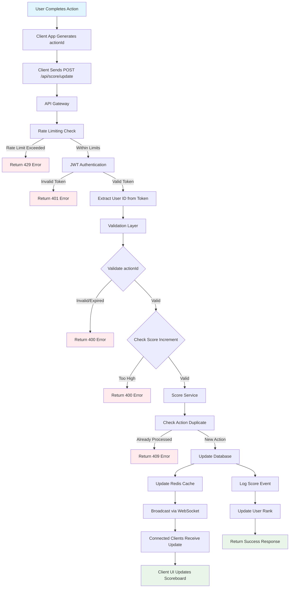
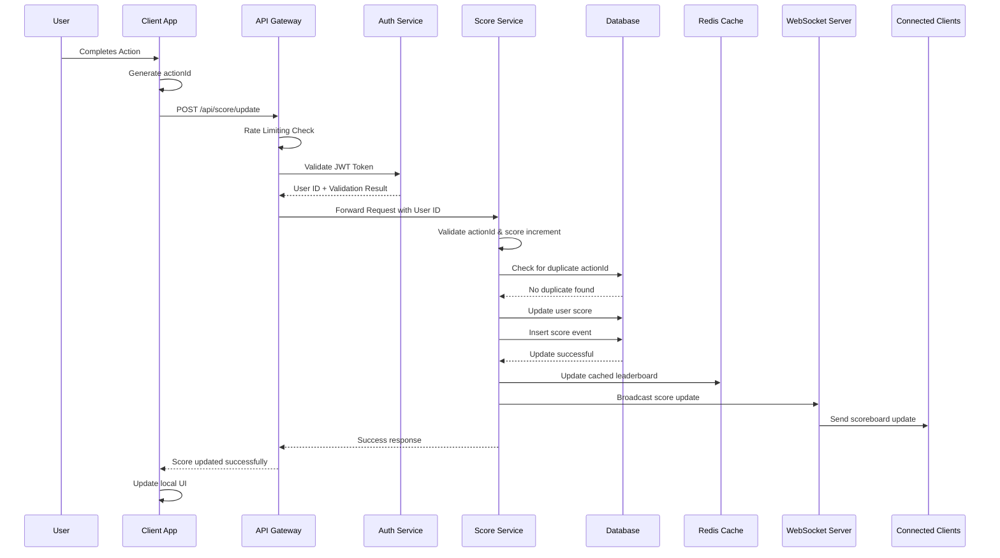
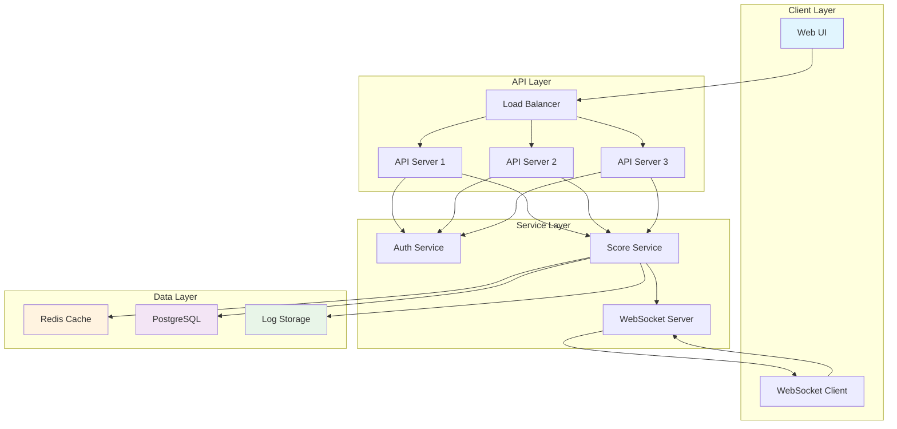
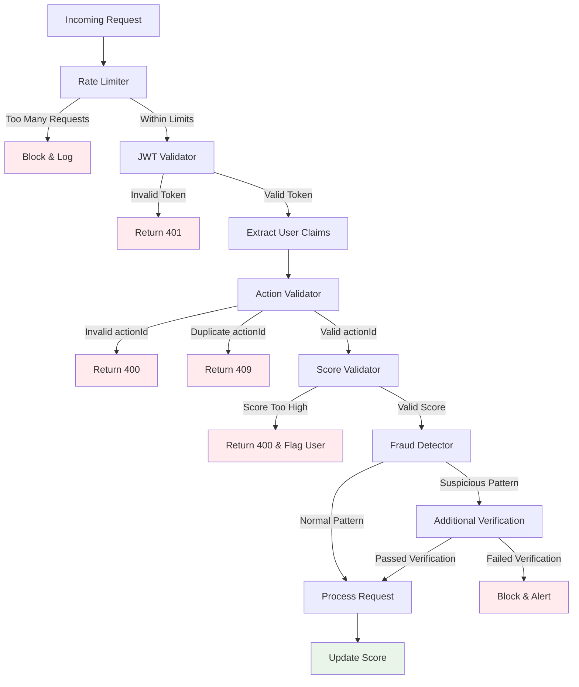

# Execution Flow Diagram

## Detailed Flow Diagram

```mermaid
graph TD
    A[User Completes Action] --> B[Client App Generates actionId]
    B --> C[Client Sends POST /api/score/update]
    C --> D[API Gateway]
    D --> E[Rate Limiting Check]
    E -->|Rate Limit Exceeded| F[Return 429 Error]
    E -->|Within Limits| G[JWT Authentication]
    G -->|Invalid Token| H[Return 401 Error]
    G -->|Valid Token| I[Extract User ID from Token]
    I --> J[Validation Layer]
    J --> K{Validate actionId}
    K -->|Invalid/Expired| L[Return 400 Error]
    K -->|Valid| M{Check Score Increment}
    M -->|Too High| N[Return 400 Error]
    M -->|Valid| O[Score Service]
    O --> P[Check Action Duplicate]
    P -->|Already Processed| Q[Return 409 Error]
    P -->|New Action| R[Update Database]
    R --> S[Update Redis Cache]
    S --> T[Broadcast via WebSocket]
    T --> U[Connected Clients Receive Update]
    U --> V[Client UI Updates Scoreboard]
    
    R --> W[Log Score Event]
    W --> X[Update User Rank]
    X --> Y[Return Success Response]
    
    style A fill:#e1f5fe
    style F fill:#ffebee
    style H fill:#ffebee
    style L fill:#ffebee
    style N fill:#ffebee
    style Q fill:#ffebee
    style Y fill:#e8f5e8
    style V fill:#e8f5e8
```

## Sequence Diagram

```mermaid
sequenceDiagram
    participant U as User
    participant C as Client App
    participant AG as API Gateway
    participant AS as Auth Service
    participant SS as Score Service
    participant DB as Database
    participant RC as Redis Cache
    participant WS as WebSocket Server
    participant CL as Connected Clients

    U->>C: Completes Action
    C->>C: Generate actionId
    C->>AG: POST /api/score/update
    AG->>AG: Rate Limiting Check
    AG->>AS: Validate JWT Token
    AS-->>AG: User ID + Validation Result
    AG->>SS: Forward Request with User ID
    SS->>SS: Validate actionId & score increment
    SS->>DB: Check for duplicate actionId
    DB-->>SS: No duplicate found
    SS->>DB: Update user score
    SS->>DB: Insert score event
    DB-->>SS: Update successful
    SS->>RC: Update cached leaderboard
    SS->>WS: Broadcast score update
    WS->>CL: Send scoreboard update
    SS-->>AG: Success response
    AG-->>C: Score updated successfully
    C->>C: Update local UI
```

## Component Architecture

```mermaid
graph TB
    subgraph "Client Layer"
        UI[Web UI]
        WS_CLIENT[WebSocket Client]
    end
    
    subgraph "API Layer"
        LB[Load Balancer]
        API1[API Server 1]
        API2[API Server 2]
        API3[API Server 3]
    end
    
    subgraph "Service Layer"
        AUTH[Auth Service]
        SCORE[Score Service]
        WS_SERVER[WebSocket Server]
    end
    
    subgraph "Data Layer"
        REDIS[Redis Cache]
        DB[PostgreSQL]
        LOGS[Log Storage]
    end
    
    UI --> LB
    WS_CLIENT --> WS_SERVER
    LB --> API1
    LB --> API2
    LB --> API3
    API1 --> AUTH
    API1 --> SCORE
    API2 --> AUTH
    API2 --> SCORE
    API3 --> AUTH
    API3 --> SCORE
    SCORE --> REDIS
    SCORE --> DB
    SCORE --> WS_SERVER
    SCORE --> LOGS
    WS_SERVER --> WS_CLIENT
    
    style UI fill:#e1f5fe
    style REDIS fill:#fff3e0
    style DB fill:#f3e5f5
    style LOGS fill:#e8f5e8
```

## Security Flow

```mermaid
graph TD
    A[Incoming Request] --> B[Rate Limiter]
    B -->|Too Many Requests| C[Block & Log]
    B -->|Within Limits| D[JWT Validator]
    D -->|Invalid Token| E[Return 401]
    D -->|Valid Token| F[Extract User Claims]
    F --> G[Action Validator]
    G -->|Invalid actionId| H[Return 400]
    G -->|Duplicate actionId| I[Return 409]
    G -->|Valid actionId| J[Score Validator]
    J -->|Score Too High| K[Return 400 & Flag User]
    J -->|Valid Score| L[Fraud Detector]
    L -->|Suspicious Pattern| M[Additional Verification]
    L -->|Normal Pattern| N[Process Request]
    M -->|Failed Verification| O[Block & Alert]
    M -->|Passed Verification| N
    N --> P[Update Score]
    
    style C fill:#ffebee
    style E fill:#ffebee
    style H fill:#ffebee
    style I fill:#ffebee
    style K fill:#ffebee
    style O fill:#ffebee
    style P fill:#e8f5e8
```