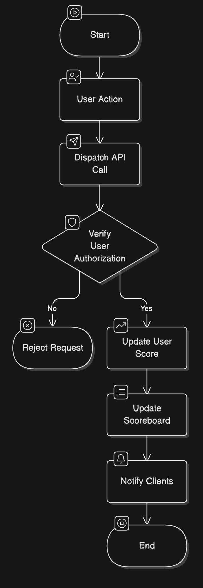

# Scoreboard API Module

## Overview
This module is responsible for handling and updating user scores on the scoreboard. It ensures real-time updates, prevents unauthorized score manipulation, and provides an efficient way to retrieve the top 10 scores.

## Features
1. **Live Scoreboard Updates** - The scoreboard will reflect real-time updates.
2. **Secure Score Updates** - Ensure only authorized actions increase user scores.
3. **Top 10 Score Retrieval** - Fetch the highest 10 scores efficiently.

## API Endpoints

### 1. Update User Score
**Endpoint:** `/api/score/update`

**Method:** `POST`

**Request Headers:**
```json
{
  "Authorization": "Bearer <token>"
}
```

**Request Body:**
```json
{
  "user_id": "string",
  "score_increment": "integer"
}
```

**Response:**
```json
{
  "status": "success",
  "message": "Score updated successfully",
  "new_score": "integer"
}
```

**Security Measures:**
- Authenticate API requests using JWT tokens.
- Verify if the action triggering the score update is valid (e.g., using an action validation service).

### 2. Get Top 10 Scores
**Endpoint:** `/api/score/top`

**Method:** `GET`

**Response:**
```json
{
  "top_scores": [
    { "user_id": "string", "score": "integer" },
    { "user_id": "string", "score": "integer" }
  ]
}
```

## Execution Flow Diagram



## Technologies & Tools
- **Database:** PostgreSQL/Redis for fast lookup.
- **Authentication:** JWT tokens.
- **Real-time updates:** WebSockets or Server-Sent Events (SSE).
- **Backend Framework:** Node.js (Express) / Python (FastAPI or Flask).

## Improvement Suggestions
1. Implement a rate limiter to prevent excessive requests.
2. Use a caching layer (Redis) for faster retrieval of top scores.
3. Add logging and monitoring for API request tracking.
4. Consider event-driven architecture using message queues like Kafka for scalability.

