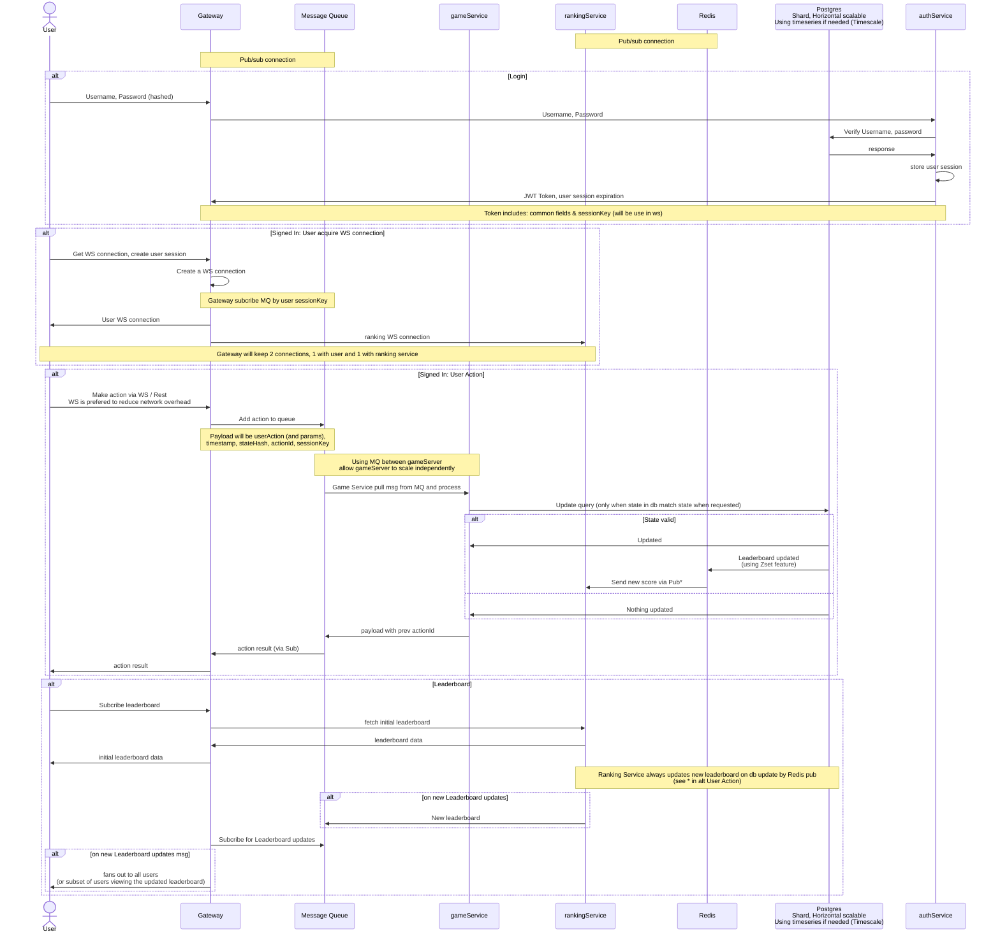

```mermaid
sequenceDiagram
    Actor u as User
    participant gw as Gateway
    participant mq as Message Queue
    participant game_s as gameService
    participant rank_s as rankingService
    participant redis as Redis
    participant db as Postgres<br>Shard, Horizontal scalable<br>Using timeseries if needed (Timescale)
    participant auth_s as authService

    Note over redis, rank_s: Pub/sub connection
    Note over gw, mq: Pub/sub connection

    alt Login
        u ->> gw: Username, Password (hashed)
        gw ->> auth_s: Username, Password
        auth_s ->> db: Verify Username, password
        db ->> auth_s: response
        auth_s ->> auth_s: store user session
        auth_s ->> gw: JWT Token, user session expiration
        Note over gw, auth_s: Token includes: common fields & sessionKey (will be use in ws)
    end

    alt Signed In: User acquire WS connection
        u ->> gw: Get WS connection, create user session
        gw ->> gw: Create a WS connection
        Note over gw, mq: Gateway subcribe MQ by user sessionKey
        gw ->> u: User WS connection
        gw ->> rank_s: ranking WS connection
        Note over u, rank_s: Gateway will keep 2 connections, 1 with user and 1 with ranking service
    end

    alt Signed In: User Action
        u ->> gw: Make action via WS / Rest<br>WS is prefered to reduce network overhead
        gw ->> mq: Add action to queue
        Note over gw, mq: Payload will be userAction (and params), <br>timestamp, stateHash, actionId, sessionKey
        Note over mq, game_s: Using MQ between gameServer <br>allow gameServer to scale independently
        mq ->> game_s: Game Service pull msg from MQ and process
        game_s ->> db: Update query (only when state in db match state when requested)
        alt State valid
            db ->> game_s: Updated
            db ->> redis: Leaderboard updated<br>(using Zset feature)
            redis ->> rank_s: Send new score via Pub*
        else
            db ->> game_s: Nothing updated
        end
        game_s ->> mq: payload with prev actionId
        mq ->> gw: action result (via Sub)
        gw ->> u: action result
    end

    alt Leaderboard
        u ->> gw: Subcribe leaderboard
        gw ->> rank_s: fetch initial leaderboard
        rank_s ->> gw: leaderboard data
        gw ->> u: initial leaderboard data
        Note over rank_s, db: Ranking Service always updates new leaderboard on db update by Redis pub<br>(see * in alt User Action)
        alt on new Leaderboard updates
            rank_s ->> mq: New leaderboard
        end

        gw ->> mq: Subcribe for Leaderboard updates
        alt on new Leaderboard updates msg
            gw ->> u: fans out to all users <br> (or subset of users viewing the updated leaderboard)
        end
    end
```
